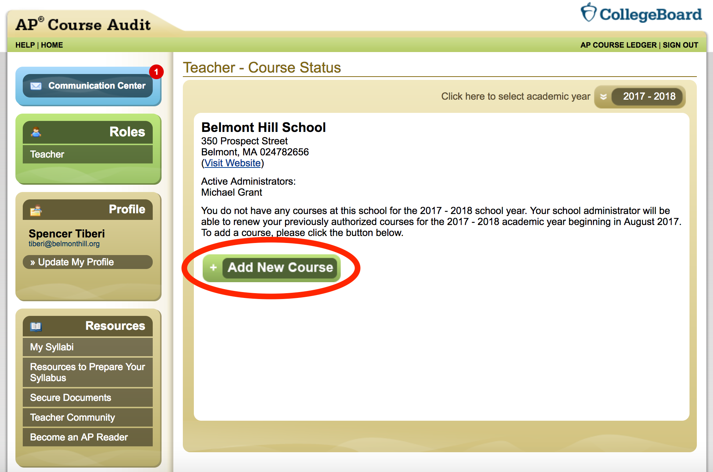
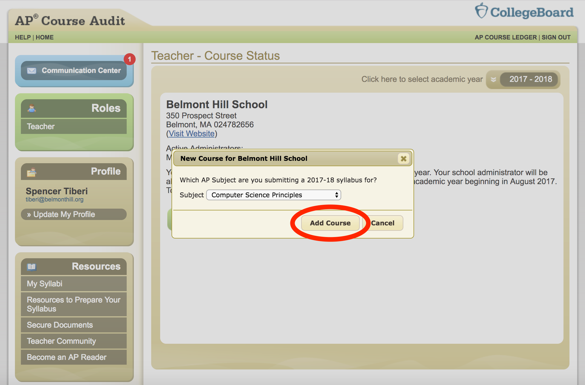
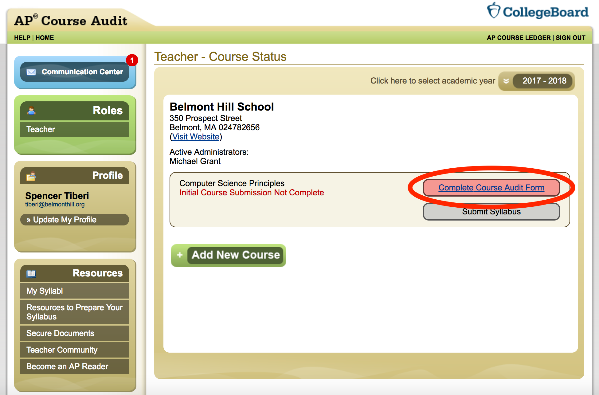
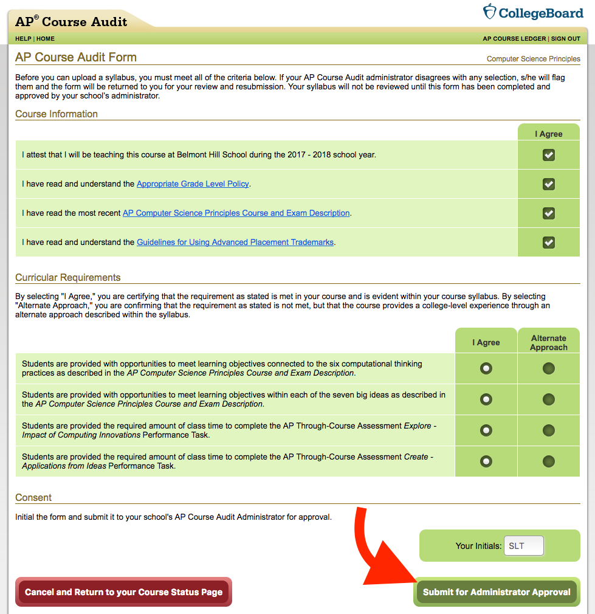
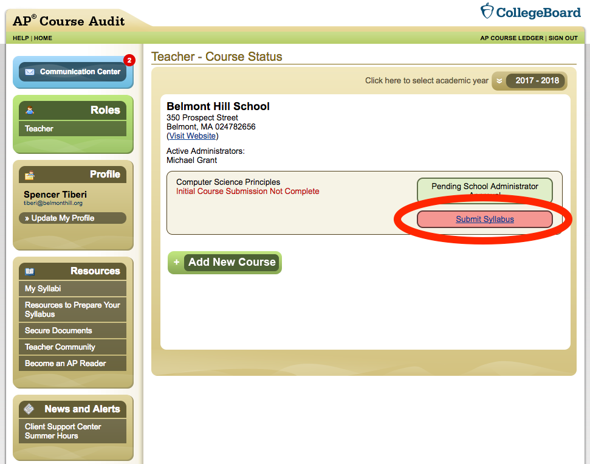
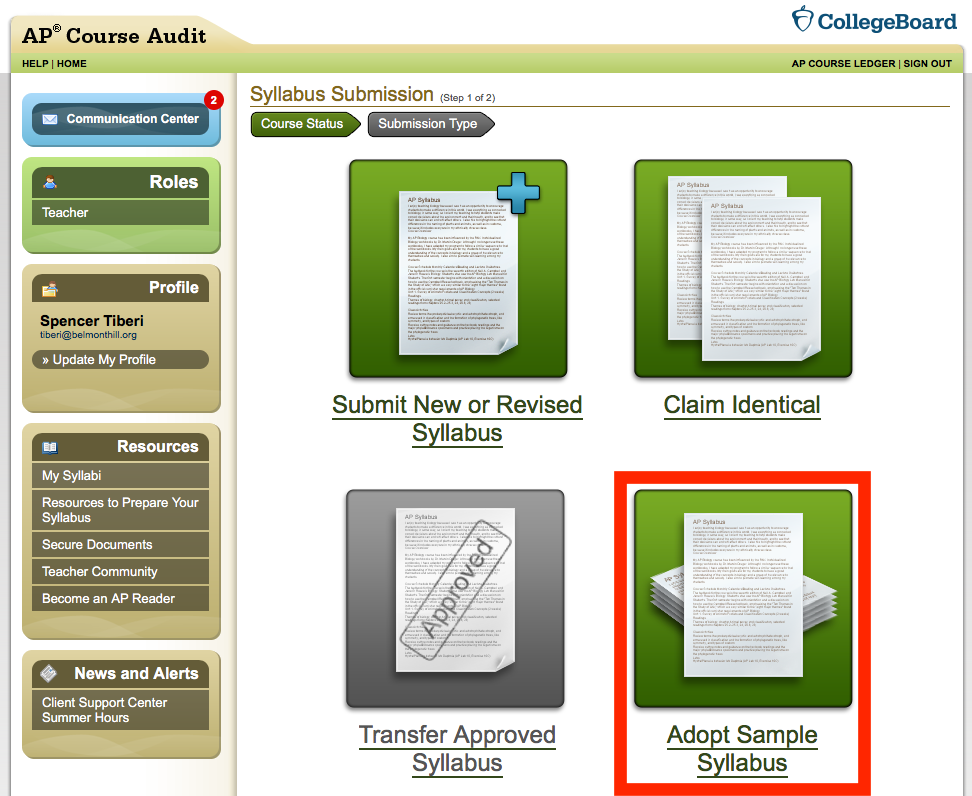
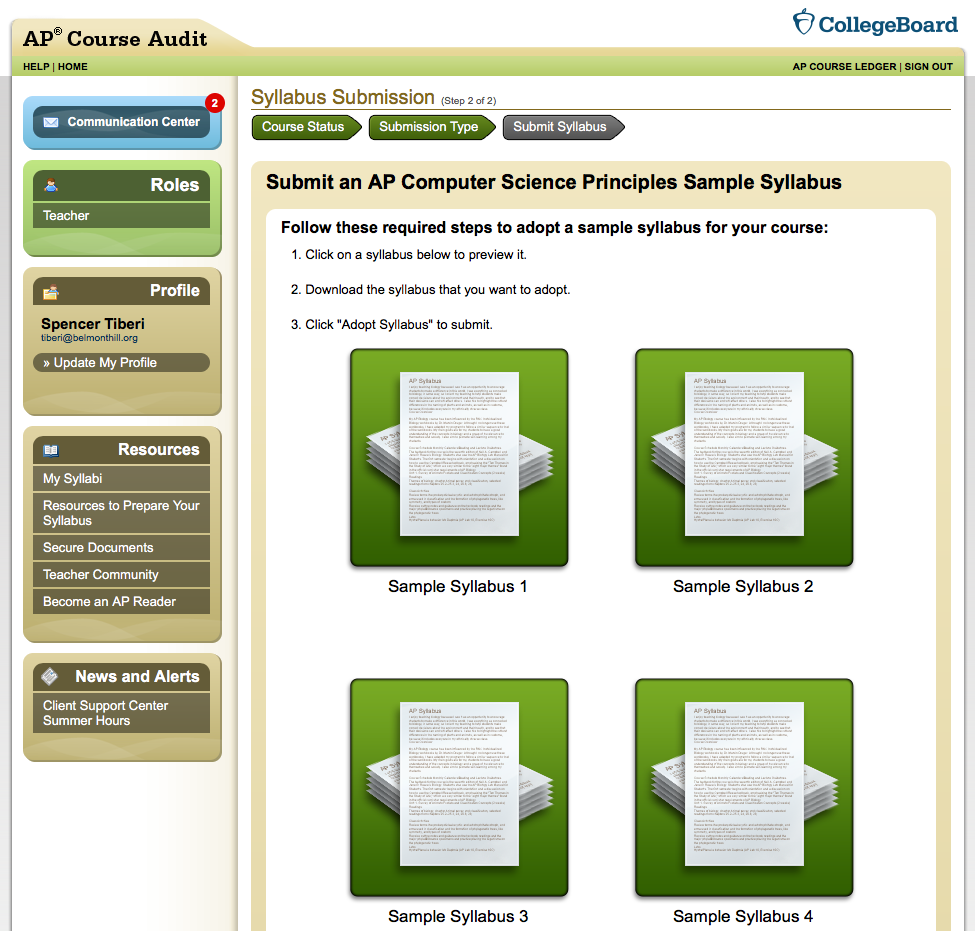
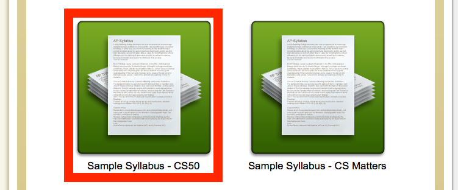
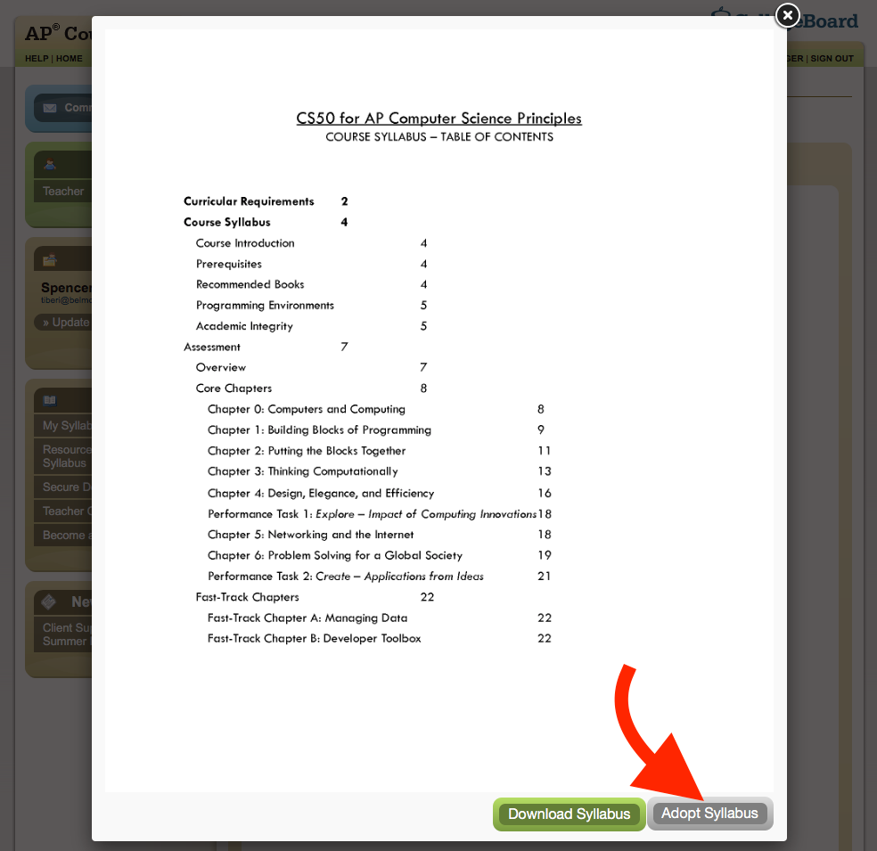
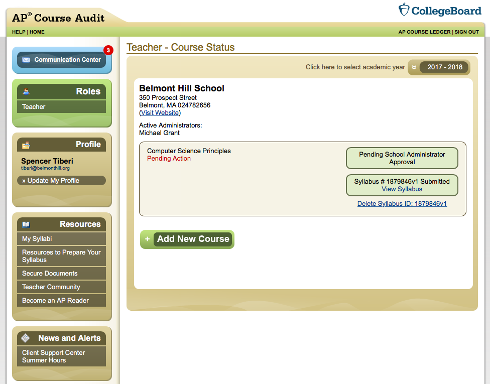

# Syllabus Audit

## CS50 AP as an Endorsed Curriculum Provider
If unfamiliar, the course audit process can sound/be intimidating, but making CS50 AP a reality at your school is pretty simple.

Due to **CS50** being a **College Board** endorsed curriculum provider for **AP Computer Science Principles (CSP)**, the process of College Board's course audit is streamlined. Perhaps most importantly, there's no need to create, submit, or request approval of your own syllabus; ours is already approved! Here's how to go through the course audit with our syllabus.

## Course Audit

### 0. Add New AP CSP Course
**Log into the [College Board course audit page](http://www.collegeboard.com/html/apcourseaudit/). If you need to make an account, follow the directions for doing so.**

**Once logged in you should see the following page:**

**Now, let's add a new AP Computer Science Principles course to your school.**

### 1. Complete the Course Audit Form
** You'll be redirected back to the page you started on, but with a new course added.  You'll want to complete the course audit form first.**

**The following page will load:**

**Be sure to check "I Agree" for all boxes and enter your initials. Then, submit for approval.**

### 2. Submit the CS50 Syllabus

**You should see the following page listing options on how to submit a syllabus. Be sure to choose "Adopt Sample Syllabus".**

**You will then see the following page listing various sample syllabi:**

**Scroll down until you see "Sample Syllabus - CS50" like below**

**Click it to look at the syllabus.**

**Note that the syllabus is a bit outdated. The syllabus listed includes courseware in PHP, which has been replaced with Python in our new syllabus. It typically takes College Board time to update changes to approved syllabi on their site, but this realistically has no effect on your class. Thus, this syllabus will do.**

**If the "Adopt Syllabus" button is grey, you will not be able to click it. To fix this, click the adjacent button to download a copy of the syllabus. The submit button should turn green after this. Go ahead and click "Adopt Syllabus"**

### 3. Now We Wait...

**When you see this screen, all you have to do is wait for your adminstrator to approve the course for your school!**

This will be CS50 AP.
