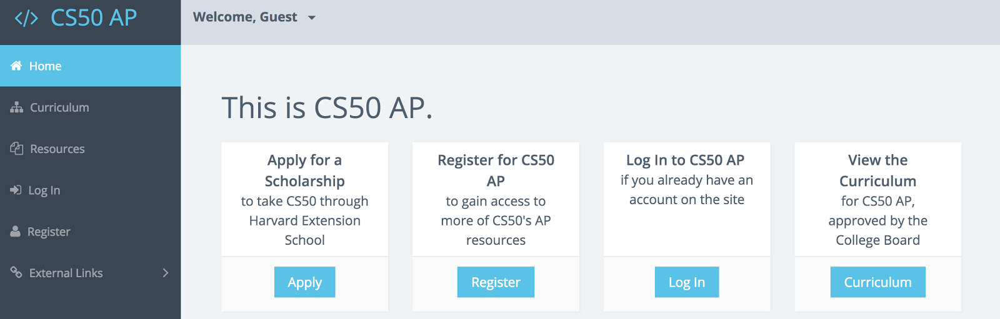
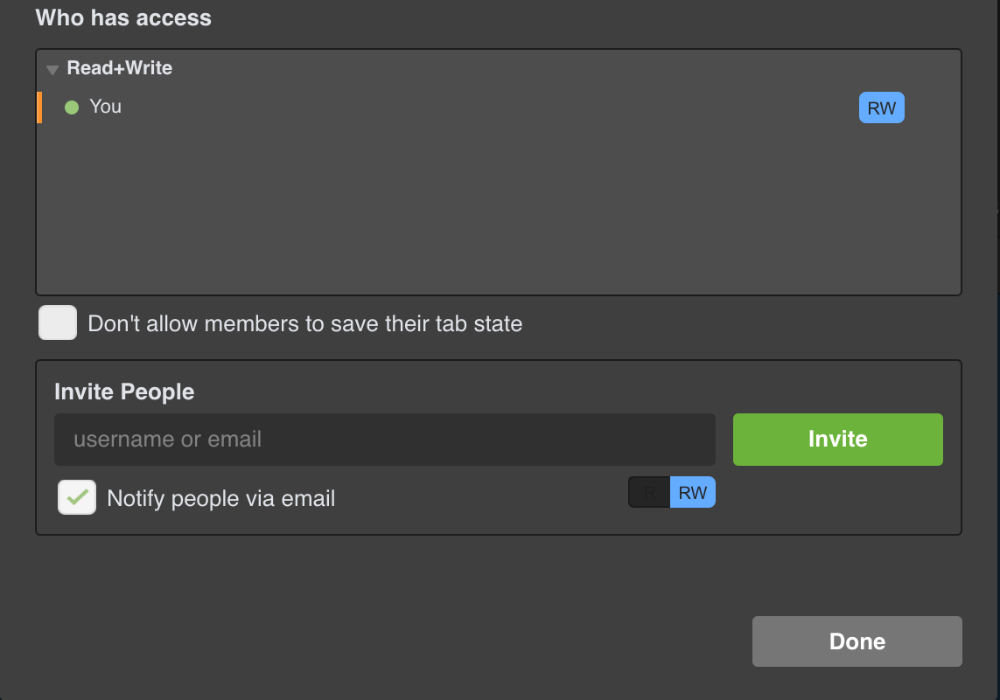
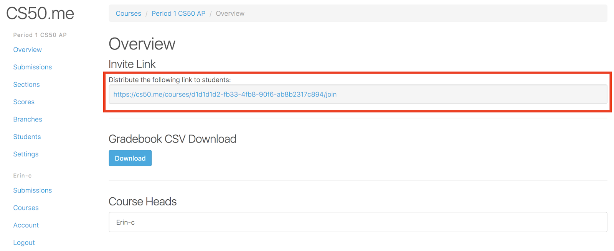

# Setting Up Your CS50 Classroom

## The Time Has Come

It's August, and now it's time to make sure everything is set up for your CS50 course. No worries! Here's a quick guide to making sure that your course's online presence is set up.

## Steps for Teachers

1\. Sign Up for an AP Portal account at cs50.harvard.edu/ap then click on “Register”!

  

2\. You will be prompted for proof of teacher status here (we ask that only teachers create portal accounts as accounts give access to solutions and grading guidelines). Email alone is not sufficient for this field. Please paste a URL that will show us your information on a staff directory or the like. If such a page does not exist on your school website, you can email a letter from your principal or a picture of your school ID, for example.

3\. Within a week you will get an email from the CS50 Bot asking you to confirm your intent to register. If you need things more quickly, please email us directly and we will do our best to expedite. The Bot email will prompt you to reply to [ap@cs50.harvard.edu](mailto:ap@cs50.harvard.edu) where someone from our team will let you know when your account has been approved.

### What is the CS50 AP Portal?

This is where all of our curricular resources live. You can find links to videos, problems, written notes, and reference sheets for each topic here. On the customize tab you have the option to toggle chapters, modules, and individual resources on or off. Your students can view your customized site at ap.cs50.net/[your_username]. Students should NOT sign up for their own portal accounts.

4\. Setup your CS50 IDE. Visit [cs50.io](cs50.io). This should already look familiar if you took the course yourself on edX. Familiarize yourself with this interface as this will be the environment preconfigured for the course that students will be coding in. There are no teacher-specific settings or preferences to set here unless you want your students to share their workspaces with you. If you would like all your students to share their workspaces with you (this is not necessarily the best way to view student work, but it is certainly one possible way!), have them click the share button in the top right corner. Then have them enter the username or email associated with your CS50 IDE. You can figure out your username by typing the command username50 at the terminal.

5\. Now that you have your working environment setup for your students you will need to setup your grading environment. We have built a tool called CS50.me for precisely this. Both you and your students will need to create GitHub accounts, which you can do at [github.com/join](github.com/join)). To get authorized as a teacher here, fill out this [Google Form](https://goo.gl/forms/rg752e4oiq8YL13h2) and you will get authorized within 48 hours. Make sure that you login to CS50.me at least once before submitting this form!

6\. Watch these screencasts: https://www.dropbox.com/sh/30xrcyozsmfyi4v/AABlSkuMF3duTGizrOsZ8aPOa?dl=0. These two videos will teach you how to create your own class and show your students how to navigate the IDE in order to check their work and submit it to you on [CS50.me](CS50.me).

7\. Lastly, you may want to check out some videos from our previous workshop for some additional guidance. You can find the YouTube playlist here: https://www.youtube.com/watch?v=l0nhqJaIYvc&list=PLhQjrBD2T381nVyoR_UDSBw-z1SKD4qwp. If you still have questions about anything, please send us an email and we will get back to you as soon as possible. We are here to help!

## Steps for Students

1\. In order for students to use the CS50 IDE they will need to sign up for a free edX account, which they should only need to do once. Encourage them to remember their username and password (some teachers have asked their students to share those passwords with them as a backup). They do not need to register for any courses, they simply need to have a username and password. They will then be able to login into the IDE via cs50.io.

2\. Students will also need GitHub accounts in order to use check50 (a correctness checker for code) as well as submit50 (a tool used to submit their work to your CS50.me class). These are also free and can be obtained by visiting [github.com/join](github.com/join).

3\. You will need to go on to your [CS50.me](CS50.me) account (after it’s authorized as a teacher account) to find your invite link and send that link to all the students who will be submitting work for your class. This will automatically subscribe you to their work submissions and enable automated grading tools.

### What is CS50.me?
This is where your gradebook will exist. Once authorized, you will have the ability to create your own course. Here, it is called “Period 1 CS50 AP.” After selecting the course, click on the overview. Here you will see the link to invite students into your class as well as the button to download your gradebook as a CSV so that you can port your grades over easily to whatever software your school uses for grading.

