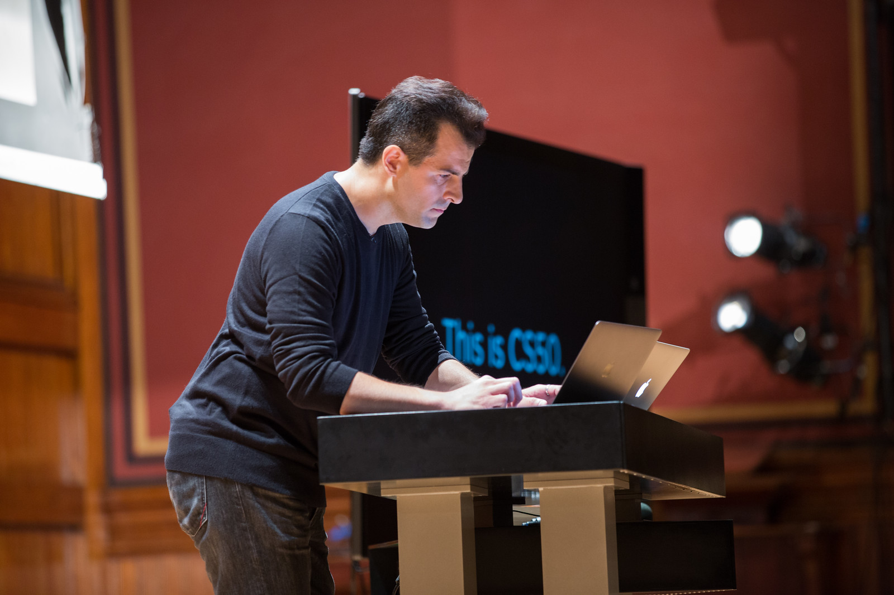

# Day 0

## So it begins...

It's the start of a new school year and you're about to stand in front of a group of students and say "This is CS50."

You're nervous, but on the surface you look calm and ready. 

This page serves as a short list of things to consider to help you feel under control and have this first day go smoothly.

## Websites to Whitelist

Whitelisting websites is essential in order for students to take CS50. Otherwise, students won't have access to the CS50 IDE and other resources.  It's best to ask administration at your school or district about this process early on. In some cases, it could take more than a month to have the websites approved to be whitelisted. Thus, best to start this process a few months out from the start of the school year. If you run into any bumps, feel free to contact us to ask for a persuasive letter at ap@cs50.harvard.edu.

To properly set up the CS50 student experience, be sure to have your school or district whitelist the following websites.

| Programming and Debugging | Grading and Submission of Assignments | Reference and Course Materials |
|---------------------------|---------------------------------------|--------------------------------|
| *.edx.org                 | *.c9.io                               | *.cs50.io                      |
| *.github.com              | *.cs50.me                             | *.cs50.tv                      |
| cs50.harvard.edu          | *.cs50.net                            | scratch.mit.edu                |

The following websites are optional, but would greatly improve the student experience.

| Student Community | Reference and Course Materials |
|-------------------|--------------------------------|
| *.facebook.com    | *.youtube.com                  |
| *.twitter.com     |                                |

## Checklist

* Websites whitelisted
* Contact [ap@cs50.harvard.edu](mailto:ap@cs50.harvard.edu) to let us know you are teaching the course
* Plan a [Puzzle Day](../events/puzzleday)
* Review Chapter 0 materials
* Ensure class website is set up
* Ensure [CS50.me](../classroom) is set up
* Have students register for edX and GitHub in order to use the [CS50 IDE](../resources/pdf/cs50ide.pdf).
