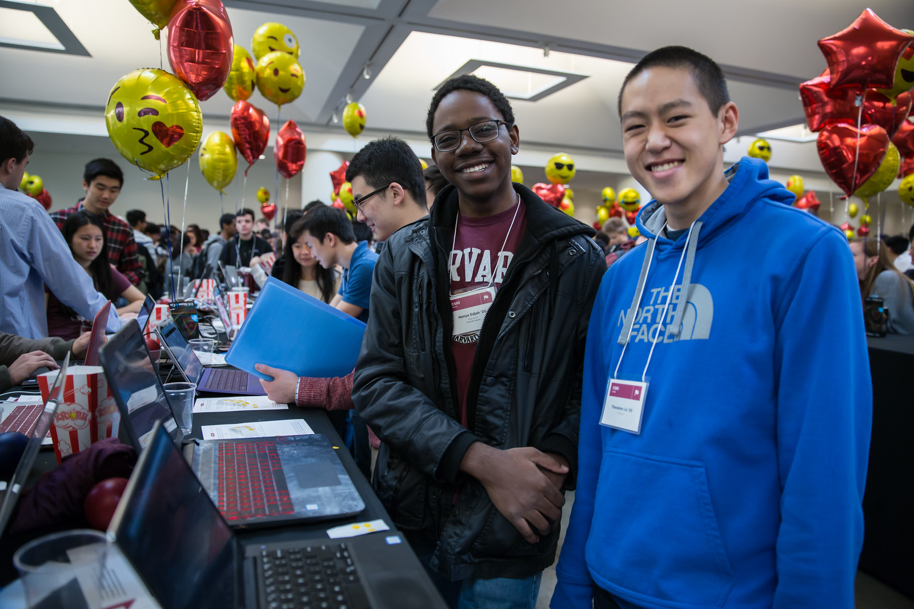

# CS50 AP Fair

## What is it?

The culminating event for CS50 at Harvard and Yale is the CS50 fair, in which students showcase their final projects. The fair is a huge event, in which members of the community are invited to see what CS50 students have accomplished. At the high school level, the fair can be used to showcase the AP exam's **Create Performance Task**. This is an opportunity for you to publicize CS50 AP and the amazing work your students have achieved, especially to younger students, who may be encouraged to take your course.

## Things to Consider When Planning a CS50 AP Hackathon

### Picking a Date

A fair at the high school level can be held during the school day, or in the evening/weekend, depending on your school's policies. Holding a fair during the school day especially benefits younger students who come on field trips). Other students can visit the fair during breaks/lunch.

### Publicity

Once the date for the fair has been decided, postcards can be sent to other local schools (including elementary and middle schools) as Save the Dates. This is a great field trip opportunity for younger students. Follow up with emails as well, which can be sent as reminders as the date approaches. Send a letter/email home to parents, inviting them as well. A sample letter by Angela Yake can be found [here](https://docs.google.com/viewer?a=v&pid=sites&srcid=ZGVmYXVsdGRvbWFpbnxjczUweGNlZGFydmlsbGV8Z3g6NmY1OTE4MGE2MjA2NjUzNg).

In addition, do not hesitate to invite other community members, from state officials to faculty from local universities. A sample invitation by Angela Yake is [here](https://docs.google.com/viewer?a=v&pid=sites&srcid=ZGVmYXVsdGRvbWFpbnxjczUweGNlZGFydmlsbGV8Z3g6NjJmZDg0ZGM2ZGE5MWUyYw). Consider bringing in local leaders in technology or education to speak. Bringing speakers to your CS50 fair can help galvanize students and create an engaging atmosphere.

Take full advantage of social media. If your school's social media policies allow, create a Facebook event (or have students create one) so that students can invite their friends and family. The same applies for creating a hashtag so that students can share the event on social media.

### Photobooth

CS50 uses a photobooth that allows students to take snapshots to be printed immediately, and then posts those pictures on Facebook after event so that students can tag themselves.

In addition, get photograph coverage for the event by having someone walk around during the fair. A great way to get a volunteer for this is to advertise for students interested in photography. If the photographs will be posted online/shared, make sure to have students complete the required release forms.

### Location

Secure a location as soon as the date has been decided. Possibilities include the school gym, cafeteria, auditorium, or even lobby.

Things to consider when choosing a location:

- If students will be showcasing web-based final projects, they will need either WiFi, or wired connection. Make sure that students will have internet access on the day of the fair. Alternatively, the offline CS50 IDE can be used, but students will need to test to make sure everything still works
- Students may need access to outlets/extension cords

### Funding/Grants

There are many sources from which you can try to get funding (either monetary or in materials). Teachers have reported being able to get t-shirts (which say “I took CS50 school name”) for free or at a significant discount from their local t-shirt printing shop. We’ve also had success contacting local businesses, who provide sponsorship in exchange for publicity.

It’s also important to note that it is *entirely* possible to run a fair without outside funding. While photobooths, balloons, and other flair can help to create a memorable experience, at its core, a CS50 fair is meant to show your community how much your students have achieved.

### Materials

#### Necessities

Tables should be set up so that students have a place to present. If you don't have access to tables through your school, tables and tablecloths can be found from local party rental supply.

#### Decorations

- Balloons and streamers can help provide a festive atmosphere.
- Posters/Banners are nice to have as well. CS50 uses [echodgraphics](http://www.echodgraphics.com/), but there may be a better local alternative. If ordering, order 2 months early to avoid express shipping.
- Fliers with a list of student projects are handy to have at the fair, and can be a nice memento.

#### Giveaways
CS50 Fairs at Harvard and Yale involve giveaways of CS50 "swag" to encourage other students to come. This is completely optional, but if you have the resources, consider

- Stress Balls (contact [ap@cs50.net](mailto:ap@cs50.net) for CS50 branded ones)
- T-Shirts

#### Refreshments

Enlist students/parents to help make and bring snacks. Consider the "messiness" factor, as it will probably be volunteers cleaning up after the fair is over. Cookies, popcorn, and pizza are all good options.

Water/drinks/cups are also important. CS50 uses Poland Springs water dispensers, and contacts [Bill Gray](mailto:william.gray@waters.nestle.com), but there many better alternative contacts locally. Place the cups near the dispensers for easy refill.

Consider breakfast for students/volunteers helping to set up. Contact local grocers/bakeries.  

NOTE: If you are having a large (greater than 150 students) fair, or combining with other schools, call your local warehouse club in advance. If you speak to a manager, they can pull all your items in advance for you, and you can just walk in, grab it, pay, and head out. You may want to rent a UHaul van to pick up food and drinks. Be sure to open only what you need. Unopened food can be returned and not paid for. Try to get any restocking fee for unused merchandise voided in writing when booking.

#### Music

Music is incredibly powerful, and can help create a festive/lively atmosphere. If you can get speakers at your location, consider finding a Pop playlist (or even [CS50's playlist](https://play.spotify.com/user/12135203541/playlist/4iRhFkdXDi74OfJsx9TlXK?play=true&utm_source=open.spotify.com&utm_medium=open)) to play music during the event.

#### Social Media

A social media presence at events not only excites current students but it can also galvanize potential future students to take CS50.  Hashtags for Instagram and filters for SnapChat are some ideas of ways to affect a larger population.  You can post information about social media on posters/banners/fliers at the event.

## Timeline/Checklist

### 6 Months Before

- Secure a date and location for the fair.
- Send out Save the Dates to local schools, public officials, and student families.

### 4 Months Before

- Arrange for tables/tablecloths/banners/decorations.

### 3 Months Before

- Email local sponsors.

### 1 Month Before

- Begin social media push, such as creating a Facebook Event.
- Assign volunteers roles for different aspects of the event such as food, others of posters, others of table setup, cleanup, etc.

### 2 Weeks Before

- If ordering custom shirts or gear for your event, contact the company/site you plan to use and ensure they can deliver to your specifications prior to the event.

### 1 Week Before

- Prepare and hang posters advertising the event.
- Have students create individual posters summarizing their projects.
  - Optional: Ask students to answer some questions on their posters, such as "greatest challenge" or "greatest accomplishment."
- Request and keep track of RSVPs.
- Organize how the student projects will be laid out on tables. A simple way is to label each table with a number, and then assign each project a number.

### The Night Before

- Ensure that all set up materials have arrived. If balloons are being used, blow them up.
- If you have access to your venue, have volunteers set up tables/banners/signage/non-perishables the night before
- If you are using a photobooth, set that up.

### The Day Of

#### 2 Hours Before

- Make sure volunteers have arrived.
- If tables etc have not been set up the night before, set them up now.
- Make sure people handling check-in know what they will be doing.

#### 1 Hour Before

- Begin check-in of students and direct them to their proper places.
- Make sure food/water is set up.

#### 15 Minutes Before

- Start music
- Make sure all volunteers in their place
  - Optional: Designate volunteers as greeters, who hand out pamphlets and direct people to proper areas
- Make sure all students are at the correct table
- Make sure photographer has arrived

#### Start Time

- Walk around putting out fires (hopefully not literally).
- Be sure to take lots of pictures and video if possible!

#### 1 Hour In

- Make sure refreshments are still stocked and not running low.  It's a great idea to delegate this role.

#### 2 Hours In

- Take some time to talk to parents/community members about your students!

#### After Completion

- Ensure that all rental items are returned on time
- Make sure volunteers have arrived to clean up
- Post pictures on social media

Many thanks to Margaret Tanzosh and Angela Yake for sharing their experiences and resources to be included in this playbook.
