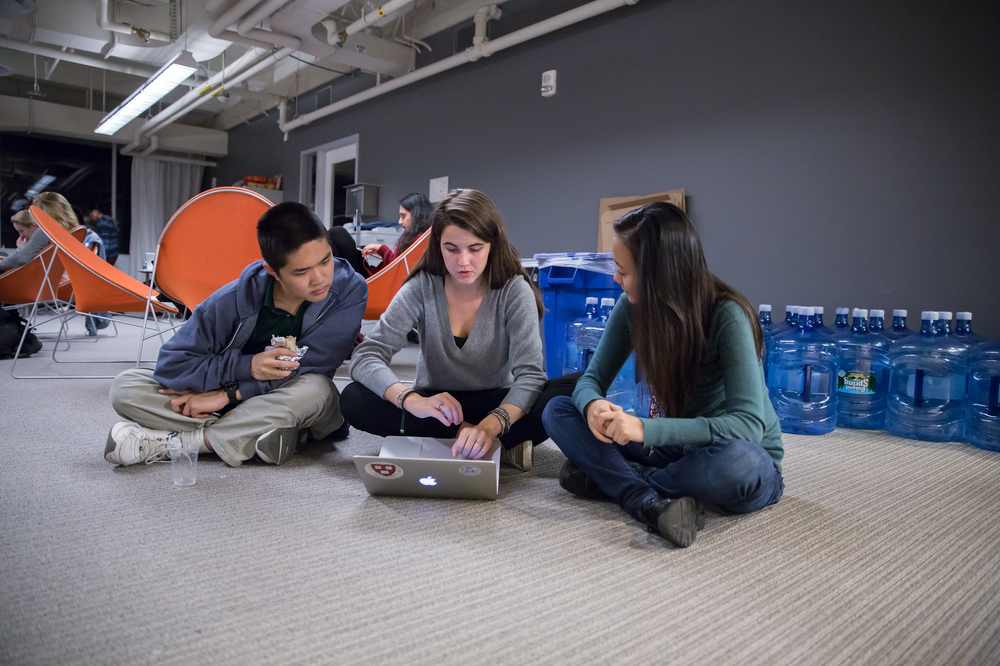

# CS50 AP Hackathon

## What is it?

On campus at Harvard College, the **CS50 Hackathon** is an epic all-nighter during which students dive into final projects with classmates and staff. Food, photos, and fun are apart of the 12-hour-long event.

However, in a high school setting, teachers typically opt for a five- or six-hour event, often starting midday on a Saturday.

The CS50 AP Hackathon is an opportunity for students to synthesize and expand on what they've learned during the course. It's a great opportunity for students to dive deeper into the AP CS Principles **Create Task**, as well as publicize your CS50 AP class. However, it can also be used as an intense problem solving session that helps reenergize students about the course. As such, we suggest that teachers hold multiple Hackathons throughout the semester.

## Things to Consider When Planning a CS50 AP Hackathon
### Publicity

Publicity for your events is essential for building CS50 AP at your school. Thus, it's a good idea open up the event to the broader school community. In addition to gauging interest in the event via survey, consider asking local mom and pop businesses for some problems that could be solved with a little computer science expertise. This not only provides the motivation of a "real-world" impact for your students, it could help you accumulate some sponsors for your CS50 Hackathon and other events.

### Food

Food is a great way to building an exciting environment for the CS50 AP Hackathon. However, most money spent on this event typically goes towards food. Reach out to local potential sponsors early and stay in touch often. Often these relationships can lead to discounted or free merchandise. Also, be sure to ask parents as well. You'd be surprised how many connections students and their parents have in the community.

Ordering food can be tricky if this is your first Hackathon, but allow us to share some insight to how we order food. In terms of meals, we order two dinners (our event is 12 hours after all). First dinner is burritos, then we bring out veggie platters, second dinner is pizza, lastly is some fruit platters. Throughout the event we leave out candy (chocolate and non-chocolate), sodas, coffee, and water. We use small plates, so that students are forced to take smaller amounts at a time. Keeping portion size smaller tends to reduce waste. Here are some portion sizes that we found helpful:

**Burritos**  
_1 per attendee (cut in half)_

We usually order 45% chicken, 25% carnitas, 10% veggie, 10% chorizo and some gluten free burritos.

---

**Veggie Platters**  
_1 platter per 20–30 attendees (This might be a lower number for high school students)_

---

**Pizza**  
_3 per attendee (ask Dominoes about corporate pricing)_

We usually order 45% cheese, 25% pepperoni, 10% buffalo, 10% green peppers and mushrooms and some gluten free pizzas.

---

**Clementines**  
_1–2 per attendee_

---

**Candy**  
_5 pieces per attendee (50% chocolate and 50% non-chocolate)_

---

**Sodas**  
_2 per attendee (we’ve noticed that this number has decreased significantly over the past few year so maybe slightly less than this)_

---

**Water**  
_1 jug (of the water cooler variety) per 35 attendees_

Note that this was for all 12 hours of our event.

---

Since your event will likely be smaller in size and shorter in time, it might be best to pick one of the meal options, one of the snack options in addition to drinks. Don’t forget about paper goods make sure there are ample cups, plates, utensils and napkins and of course some dispensers for the water jugs mentioned above. Make sure there are lots of trash cans around food and drink areas. Have a volunteer monitor water levels and snack tables to replenish as necessary.

Definitely order food the at night before, at least; the order is large and they will appreciate the lead time. The amount of time you wish to giveSchedule delivery for at least 30 minutes before the doors are opened.  Food is usually late with large orders, so be sure to request the food to be delivered before the time you actually do want it!

### Venue

So far we have our attendees and funding covered, let’s talk venue. Decide on a space early on. A gym-like area with lots of open space often works well. Take note of how much signage you’ll need to fill the space. Signage should direct students to:

* Sign-in when they show up.
* Bathrooms.
* Food options.
* Other rooms that are part of the event.

If access to the building is secured, send over a guest list ahead of time, for access. Decide on table layout before setting up and figure out how to distribute power cords through out the space. Contact your school’s grounds keepers or the like to have them set up power so as not to short circuit the venue. Also make note to talk to network folks to ensure there’ll be sufficient internet bandwidth during the event.

### Essential Items

Tables should accommodate groups of size one, two, and three. It’s nice to disperse tables throughout each room you use (not just along edges). In adjacent room have a staff/chaperone/volunteer area that students are not allowed in. Everyone needs their space to breathe! Make sure to print out some Staff Only signs for the doors. Run a photo loop from the year on a display screen. This lets students remember how far they’ve come.

The day before the event you’ll want to transport all nonperishable items, like candy, tables, signage, and any additional items that can stay in the venue over night. If need be, get a zip van or Uhaul van for 48 hours and make sure to rent one early, as it’s hard to get one for two days on short notice. We recommend 48 hours so that you can use the van to shop for food/beverages two days before and then transport it to the venue the day before. You’ll probably want to bring everything from wherever you were storing it to the venue the afternoon before to expedite setup on the day of.

If you’re planning on giving out shirts as swag, have attendees fill out a Google Form or the like to collect sizes. You could also ask sponsors if they have anything worth donating for a giveaway. We’ve also found it useful to have these things on hand:

* Tablecloths for food, candy, EMS, and checkin tables.
* Black sharpies for name tags and last minute signs
* Name tags are adhesive, print 15% extra than expected attendees (printed 2 days in advance)
* Bring one box of poster adhesives
* Hang a sign above the check in table that tells people WHERE to check in. Use arrows, it leaves no wiggle room for silliness.
* Arrive at venue 4 hours prior to start of Hackathon to make sure last minute problems can be addressed
* Bring a box of garbage bags.

### Other Logistics

#### Parents
Parents can be one of your biggest assets. Be sure to reach out for support and help from parents when running a Hackathon. Often, parents can help with supplies or volunteer their time.

#### Volunteers
To reduce headache, you’ll want a list of volunteers, their phone numbers, and any roles you’ve assigned them. This way you’ll know exactly who to call if something goes wrong. We here at CS50 open a slack channel during the Hackathon and invite all participants to jump on as well. This way we can make announcements without disrupting students’ workflow.

#### Student Collaboration
Students will be collaborating at this event to work through bugs, so make sure you define the extent in which you want them to collaborate and expose them to some platforms for doing so such as collaborator mode in the IDE and Github.

#### Security
Also, be sure to notify school security about the event. Many schools have alarms armed on the weekends. Nothing kills the mood like alarms going off and having to wait for police to arrive.

## Timeline/Checklist

**Okay... Let's do this!**

### 6 Months Before

* Secure a date and location for the Hackathon.
* Assemble a committee (not your full list of volunteers) who will help you with the event.
* Hold a meeting where you go over do further brainstorming and delegate responsibilities.

### 4 Months Before

* Assign the [pre-proposal form](https://docs.google.com/viewer?a=v&pid=sites&srcid=ZGVmYXVsdGRvbWFpbnxjczUweGNlZGFydmlsbGV8Z3g6Nzc5NDc1YjNkZTlhMWFiMw) to students to see what students plan to be working on during the event.
* Show students some cool projects that have been done in the past at your own school or the CS50 youtube channel.
* Arrange for tables, power cords, banners, and decorations.

### 3 Months Before

* Assign the [proposal form](https://docs.google.com/viewer?a=v&pid=sites&srcid=ZGVmYXVsdGRvbWFpbnxjczUweGNlZGFydmlsbGV8Z3g6Nzc5NDc1YjNkZTlhMWFiMw)
* Email local sponsors.
* Think about what food you want, and reach out to these places for discounts.

### 1 Month Before

* Begin social media push.
* Create Facebook Event.
* Have students take responsibilities for different aspects of the event.
* For example, some students should be in charge of food, others of posters, others of table setup, cleanup, etc.
* Check in with student projects or have them submit status reports.
* Send out a form to your school asking for RSVPs to the Hackathon. On the form, get dietary information.

### 2 Weeks Before

* Make sure student committees are on track.
* Start a unit for students on how to collaborate effectively.
* Hold in-class time for students to get started on their projects.

### 1 Week Before

* Call the place(s) you're getting food from and place your orders. Ideally, have them deliver the night of.

### The Night Before

* Ensure that all set up materials have arrived. If balloons are being used, blow them up.

### The Day Of

* Set up location with tables/decorations/food/power cords.
* Put out fires (hopefully not literal ones).

Many thanks to Margaret Tanzosh and Angela Yake for sharing their experiences and resources to be included in this playbook.
