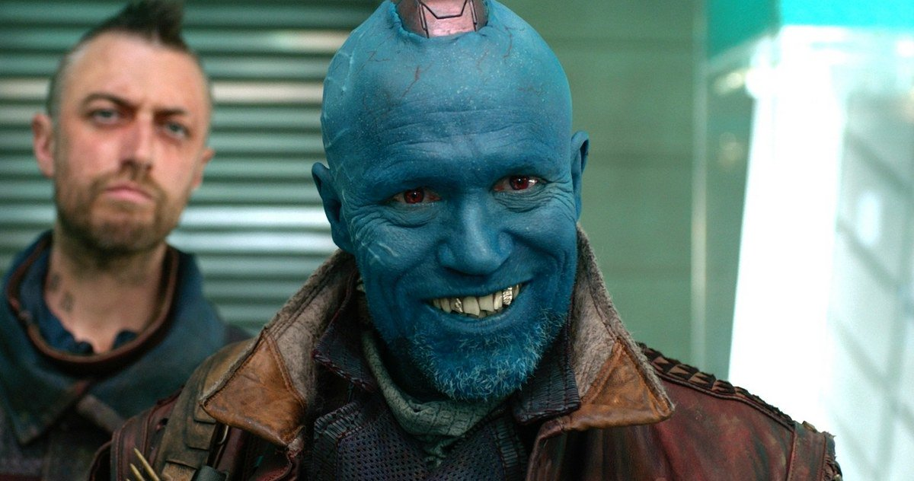

# Events and Culture

## Classroom Culture

The development of CS50 culture at your school is a big part of making the course more accessible and engaging for students. During any given semester at Harvard, over 70% of the students taking CS50 have no previous programming experience. The galvanizing culture of CS50 helps students become comfortable with taking on the challenge of learning a new concept. To help create a culture that is CS50 at your school, consider some of the following.

### Showmanship

As a teacher, never be afraid to use a little showmanship. Adding your personal flare and quality production goes a long way to give your class a fun and engaging vibe. In the past, I have personally used streamers for special occasions, humor subtly-embedded into assignments, and well-timed classroom music to help enhance the classroom experience.

### Occasional food, snacks, or treats

> "A spoonful of sugar helps the medicine go down."
>
> -- Mary Poppins

Food and culture go hand in hand. It can help events become more engaging. It can also take the edge off of when students feel stressed. For example, I used to give cupcakes to my students on test days.

### Photobooth

At Harvard, we typically set up a photobooth during CS50 events. This has proven to be a valuable cultural addition to the event. We have it set up so that photos stream straight to twitter.

## CS50 events

CS50 events are a huge part of what makes CS50 AP tick. They not only increase notoriety on campus and in the community, but they also help students feel more comfortable and excited about material that otherwise may be intimidating. These events are at the heart of CS50 culture. We want to make sure to provide you with a wealth of advice on running events at your school. If you need any help with this process, feel free to contact the CS50 AP staff.

### [Puzzle Day](puzzleday)

A puzzle solving extravaganza designed to get students excited about problem solving.

#### Sample Schedule

| Time            | Event                                                  |
|-----------------|--------------------------------------------------------|
| **11:45**       | Doors open                                             |
| **11:45-12:15** | Lunch                                                  |
| **12:15-12:30** | Instructions                                           |
| **12:30-2:45**  | Puzzle solving; solution packet in by 2:45 on the dot! |
| **2:45-3:00**   | Solutions revealed                                     |

### [Hackathons](hackathon)

On campus at Harvard, the CS50 Hackathon is a 12-hour programming marathon. For CS50 AP, it's a great opportunity to build community and reenergize students.

#### Sample Schedule

| Time            | Event                                                  |
|-----------------|--------------------------------------------------------|
| **11:45**       | Doors open                                             |
| **11:45-12:15** | Lunch                                                  |
| **12:15-12:30** | Instructions                                           |
| **12:30-2:45**  | Students work on assignments/code                            |

### [CS50 Fair](cs50fair)

The CS50 is a celebration of student achievement where students showcase their final projects.

#### Sample Schedule

| Time            | Event                                                  |
|-----------------|--------------------------------------------------------|
| **11:45**       | Doors open                                             |
| **11:45-12:00** | Students sign in                                       |
| **12:00-2:00**  | Students showcase their projects                       |
