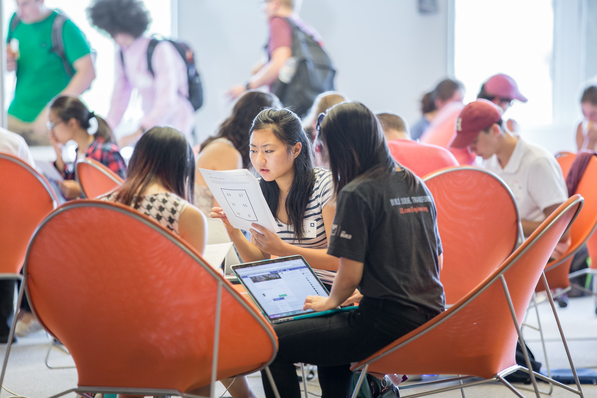
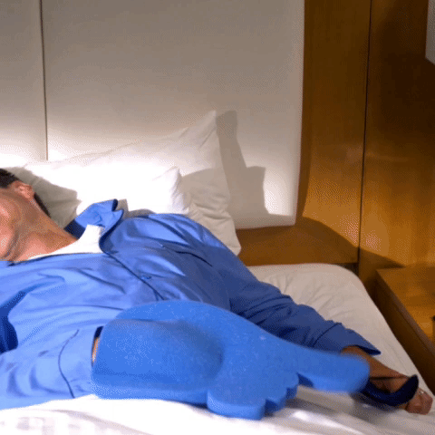

# CS50 AP Puzzle Day

## What is it?

CS50 Puzzle Day is a CS50 tradition at Harvard since 2011. It kicks off the course with puzzles, food, and prizes! None of the puzzles require programming experience as to emphasize that computer science is not all about programming, but rather problem-solving. Indeed, the event is open to all regardless of background or enrollment and bringing friends is encouraged of students.

## Things to Consider When Planning a CS50 AP Puzzle Day

### Food

We typically order pizza assuming 3 slices per person. Sometimes that overshoots it, sometimes it's just right. We also usually order one large-sized veggie platter for every 20 or so pizzas. College kids are probably more health-conscious than high schoolers, though!

Definitely be sure to order food the at night before, at least; the order is large and they will appreciate the lead time. The amount of time you wish to giveSchedule delivery for at least 30 minutes before the doors are opened.  Food is usually late with large orders, so be sure to request the food to be delivered before the time you actually do want it!

Bulk candy and beverages from Costco can be handy.  Depending on what's best for your school, either canned soda at two cans per person or two-liter bottles at one bottle per four people is a good estimate.

Don't forget to talk to local businesses to see if they will help subsidize!

### Setting the Tone of the Event

Be sure to encourage that "winning" isn't the goal -- problem solving and creative thinking is the goal. Having fun is the most important thing.  If giving out prizes to winning team(s), we suggest also setting up raffle prizes and minimally message the element of prizes to ensure most people don't attend expecting or looking for a prize.

## Timeline/Checklist

### 1 Month Before

- If ordering custom shirts, posters, or gear for your event, contact the company/site you plan to use and ensure they can deliver to your specifications prior to the event.

### 2 Weeks Before
- Prepare and hang posters advertising the event.
- Request and keep track of RSVPs.

### 1 Week Before

- If you haven't received Puzzle Day materials, be sure to let us know at [ap@cs50.harvard.edu](mailto:ap@cs50.harvard.edu)

_Tip 1: Be sure to give at least one week for materials to arrive if shipping into the continental United States. International orders typically take a few weeks._

- If ordering custom shirts or gear for your event, contact the company/site you plan to use and ensure they can deliver to your specifications prior to the event.
- Have students sign [release forms](http://cdn.cs50.net/ap/1617/events/puzzles/1617_release.pdf) as to be able to share photos and videos with us and so we may share them too!

### The Day Before

- Ensure that all set up materials have arrived. If balloons are being used, blow them up.
- If possible, supply extra paper, whiteboard, or easels with large format presentation paper, so groups have a large surface on which to experiment with solutions.
- Obtain paper plates and cups.
- Order food.

_Tip 2: We typically order pizza assuming 3 slices/person. Sometimes that overshoots it, sometimes it's just right._

_Tip 3: Definitely order the night before; the order is large and they will appreciate the lead time. Schedule delivery for at least 30 minutes before the doors are opened.  Food is usually late with large orders, so be sure to request the food to be delivered before the time you actually do want it!_

_Tip 4: We usually order one large-sized veggie platter for every 20 or so pizzas. College kids are probably more health-conscious than high schoolers, though!_

_Tip 5: Bulk candy and beverages from Costco can be handy.  Depending on what's best for your school, either canned soda at two cans/person or two-liter bottles at one bottle/four people is a good estimate._

- If possible, supply extra paper, whiteboard, or easels with large format presentation paper, so groups have a large surface on which to experiment with solutions.

_Tip 6: Don't forget to talk to local businesses to see if they will help subsidize!_

### The Day Of

#### 2 Hours Before

- Set up two hours before start time.
- Be sure to take lots of pictures and video if possible!
- Encourage students to create groups with folks they normally might not.

At the College, we have found that just over two hours to work on the puzzles is a good sweet spot for undergrads. Usually just a few teams are able to complete them all, but everyone is able to complete a few and so it's still lots of fun!
