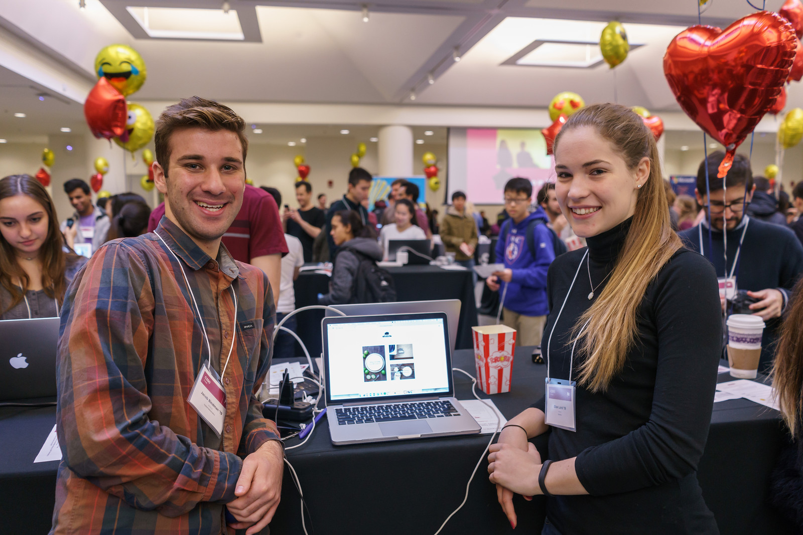

# CS50 Final Projects

## Student Projects

CS50 at Harvard culminates in a final project that students showcase at the CS50 fair. The creation of this final project maps to the AP CSP Create Task well.

## Helping Students Pace Themselves

In CS50 at Harvard and Yale, students are required to submit a series of forms, including a **pre-proposal**, **formal proposal**, and **status check** on their final project. Eventually, students are required to write up documentation and record a 2 minute video showcasing their project. You are welcome to use any/all of the forms and wording.

The pre-proposal is an opportunity to urge students to begin thinking about what they would like to tackle for their project.
The proposal should ask students to:

* Outline what they hope to achieve in their project.
* CS50 uses the terminology **“good”**, **“better”**, and **“best”** to ask students to clarify what they *will* accomplish, *think* they can accomplish, and *hope* to accomplish, respectively.
* Consider what tools/skills they will need to learn.
* Decide whether they are working in groups, and if so, with whom.

NOTE: Students should not feel limited to the languages/APIs used in class. CS50 has seminars on various topics which may be applicable to the **Create Performance Task**, but it should also be emphasized that students are expected to find and use resources outside of the class, and that you as a teacher will not know all the answers.

### Possible Lessons Plans

* Based on pre-proposals and comments, prepare lessons and sample code for common tasks, like logging a user, connecting to a database, or reading new documentation.
* Examples of project management tools, whether software or a paper based system. See [Margaret Tanzosh’s post on using Scrum Boards](http://cs50xnestm.mywebcommunity.org/process.html).

#### Teacher Created Resources

* [Pre-proposal Form](https://docs.google.com/viewer?a=v&pid=sites&srcid=ZGVmYXVsdGRvbWFpbnxjczUweGNlZGFydmlsbGV8Z3g6Nzc5NDc1YjNkZTlhMWFiMw) —  Angela Yake
* [Final Project Instructions ](https://docs.google.com/viewer?a=v&pid=sites&srcid=ZGVmYXVsdGRvbWFpbnxjczUweGNlZGFydmlsbGV8Z3g6NGJhZTIwYzgxNDMyYjg0YQ) —  Adapted from CS50 instructions by Angela Yake
* [Final Project Lesson Plans](https://drive.google.com/file/d/0B_sRt5c3WoLKR3VQSTZudmo3VEozV3lhYlJfcG5aVzNaempR/view?usp=sharing)  —  By Margaret Tanzosh
