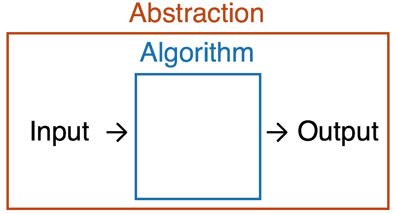
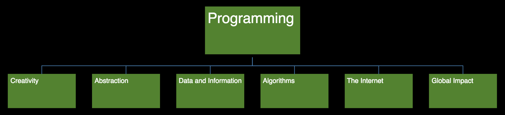

# CS50 AP Workshop 2017

## CS50 and the AP CSP Curriculum Framework

### Introductions
- Erin briefly introduces herself and fields questions.

### Overview of AP CSP Mapping
- The CS50 curriculum has been mapped to the AP Computer Science Principles framework.
  - Now CS50 is an endorsed provider of curriculum by College Board, which makes it easier to adopt.
- The AP CSP curriculum framework can be found at [http://bit.ly/1TolLoG](http://bit.ly/1TolLoG).
- There's a hierarchy of how the AP CSP is laid out.
  - 7 Big Ideas
    - 6 of them are tested on the exam, excluding Creativity.
    - 24 Enduring Understandings
    - 44 Learning Objectives
    - 312 Essential Knowledge Statements
   - 6 Computational Thinking Practices
    - More of what the students are actually doing.
  - 2 through-course assessments
    - Explore
      - Research assignment where they are looking into the pros and cons of a technology.
    - Create
  - AP Exam (multiple choice) - May 11, 2018

### Big Ideas
1. Creativity
  - Hard to test with multiple choice, but heavily featured in the create and explore tasks.
  - How creative are students with making programs from scratch
    - Items produces by students are referred to as computational artifacts by College Board.
    - Students in this course use the tools and techniques of computer science to create **interesting and relevant artifacts** with characteristics that are enhanced by computation.
2. Abstraction
  - Abstraction and algorithms are two keywords that college Board is looking for in the writing portion of the through-course assessments.
  - Abstraction is like the drawing activity during David Malan's previous section.
    - "Draw a circle"
    - "Draw a square"
  - This concept often manifests itself as functions in CS50 AP.
    - "I don't need to know what this function does in my main function, I can abstract that out to a separate function."
      - This allows one to use the function multiple times, without having to reimplement or copy and paste code.
  - "This course requires students to use abstractions to **model the world and communicate with people** as well as with machines. Students in this course learn to work with multiple levels of abstraction while engaging with computational problems and systems"
    - Allowing people who don't have a background in the low-level details of code to understand what's happening.
    - CS50 encourages heavy commenting.
  - low-level implementation of drawing a square using specific language.  
    **place pen on paper  
    move pen one inch up  
    move pen one inch right  
    move pen once inch down  
    move pen one inch left  
    lift pen**
  - Slightly higher-level implementation of drawing a square using concept of coordinates.  
    **set pen down at (0, 0)  
    move pen to (0, 1)  
    move pen to (1, 1)  
    move pen to (1, 0)  
    move pen to (0, 0) lift pen**
  - Now, utilizing the abstraction of a square, ww can get a high-level implementation  
    **place pen on paper  
    draw a one inch by one inch square  
    lift pen**
3. Data and Information
  - Touched upon in a lot of different chapters.
  - Erin states that she'll be posting the mapping of the topics to all CS50's curriculum.
    - The big ideas are spread out amongst CS50's chapters.
  - "Students in this course **work with data** using a variety of computational tools and techniques to better understand the many ways in which data is transformed into information and knowledge."
  - In later problems, students have to work with databases and backend.
4. Algorithms
  - The Create tasks requires students to identify an algorithm and an abstraction.
  - CS50 likes to define algorithms as what turns input into output. The abstraction is defining this who process.
   
  
  - “The development, use, and analysis of algorithms are some of the most fundamental aspects of computing. Students in this course... **develop and express original algorithms**, they implement algorithms in a language, and they analyze algorithms analytically and empirically.”
  - After this year, students will have to create their own algorithms to get credit on the Create task.
5. Programming
  - Everything in CS50 is seen through the lens of programming.
  - “Programming enables problem solving, human expression, and creation of knowledge.... The course acquaints students with fundamental concepts of **programming** that can be applied across a variety of projects and languages.”
6. The Internet
  - A topic where students often want more info on because it relates to their life on a daily basis.
    - Some teachers will supplement the CS50 material to dive deeper into this topic.
    - Students will often create web apps for final projects.
  - “Students in this course **gain insight into how the Internet operates**, study characteristics of the Internet and systems built on it, and analyze important concerns such as cybersecurity.”
    - Not only learning what you can do with web programming, but how the internet works.
      - What happens when you go to Google.com?
    - There is a focus on security implications as well.
7. Global Impact
  - Investigating the impact of sharing code and programs with the world.
    - How can this fire up change?
  - “Students in this course become familiar with many ways in which **computing enables innovation**, and they analyze the potential benefit and harmful effects of computing in a number of contexts.”
    - If one student creates something, how can that foster further creation.
      - Students will get a taste of this with the problem Mashup, where students will take existing APIs for Google Maps and Google News to create a news map.

  

### Computational Thinking Practices
1. Connecting Computing
  - Connected with Global impact; how are we linking everything together?
2. Creating Computational Artifacts
  - Students have to do throughout the course
  - Recall artifact is an umbrella term for anything students create.
3. Abstracting
  - The Computational Thinking Practices overlap with the Big Ideas.
  - If you hit the Big Ideas, you'll cover them as well.
4. Analyzing Problems and Artifacts
  - CS50 is looking to adding questions about problems at the end of the specifications so students are comfortable with this process before the Create task.
    - There will be an emphasis on identifying algorithms and abstraction.
5. Communicating
  - How to articulate ideas.
  - In CS50, this mostly manifests as comments to help convey ideas.
    - Perhaps have students start with comments as pseudocode.
6. Collaborating
  - Code.org is championing pair programming.
    - One student is typing and the other is coming up with ideas.
  - Can be just discussing an idea.
  - College Board allows collaboration on the Explore and Create tasks, but only up until the point of implementation.
    - Students need to submit their own implementation.
    - Students must highlight their individually created code.
    - Students should stray away from using language like "we did this" in favor of "I did this" on the Create task.

### Through-Course assessments
- Explore
  - 8 classroom hours are required by College Board.
  - Students research current issues in technology and investigate the implications of that technology’s impact on society.
    - Try to push students towards unique topics and stray away from overly popular ideas that AP graders may grow tiresome of.
    - Nice to do after chapter 0 as to not interrupt student progress on coding.
  - 16% of overall AP score.
- Create
  - 12 classroom hours are required by College Board.
  - Students build an application of their own choosing to solve a problem of interest to them.
    - Covers the creativity requirement.
  - Typically teachers introduce the task in January to help students brainstorm ideas.
    - This time counts towards classroom hours.
  - 24% of overall AP score.
  - All tasks need to be turned in by the last Friday in April.
- AP Exam
  - 60% of overall AP score.
  - When you complete the AP audit of your course, you should receive access to a practice test.
  - It's 2-hour exam consisting of ~74 questions.
    - Covers 6 0f the 7 big ideas (not Creativity).
      - ~20% each on Algorithms and Programming.
      - ~18% each on Abstraction and Data/information.
      - ~12% each on The Internet and Global Impact.
  - AP CSP is language agnostic, so you can teach your students in any language without hindering your students on the AP Exam.
    - College Board uses a Scratch-like language for problems with programming.
    - A reference sheet for the language is given to students on the AP Exam.
      - This is nice to show to students before the AP Exam.

### CS50 AP Curriculum
#### Overview
- 9 Chapters
  - 7 core chapters that CS50 feels are essential.
  - 2 optional Fast Track chapters that you can assign to some or all of your students.
    - Material covered in these chapters is not on the AP Exam.
  - Video resources for teachers and students, written resources, suggested in-class exercises, and more.
    - Erin highlights the usage of [cs50.harvard.edu/ap](https://cs50.harvard.edu/ap), where curriculum and resources currently live, but is going though some changes soon.
      - Resources are listed by type
      - Grading guidelines will be moved over to GitHub.
- 50+ problems
  - writing
    - Used to prepare students for the Explore task during Chapter 0.
    - Good opportunity to give feedback on writing, because you can't give feedback on the Explore task.
      - Students will submit the Explore and Create tasks through the [AP Digital Portfolio](https://account.collegeboard.org/login/login?appId=295&DURL=https%3A%2F%2Fdigitalportfolio.collegeboard.org%2F%23instruction).
        - Teachers have to set the portfolio up and students submit to it.
  - programming
    - Many offered in multiple variations for students with differing backgrounds.
      - More Comfortable and Less Comfortable versions.
        - Students are free to do both, if desired.
- Final Project
  - Maps to the AP Create tasks.
  - Examples of students' Create Task submissions exist from [College Board](https://apcentral.collegeboard.org/courses/ap-computer-science-principles/exam?course=ap-computer-science-principles).

#### Chapters
##### 0. Computers and Computing (2 - 3 weeks)
- Addresses hardware that makes up a computer.
- Sample topics include:
  - What does it mean to “compute”? How do we define a “computer”?
  - How do computers work?
  - binary
  - ASCII
  - algorithms
- Big Ideas:
  - Abstraction
    - "I'm moving my mouse, what's happening on a low level? High level?""
  - Algorithms
    - Describing things with words.

##### 1. Building Blocks of Programming (3 - 4 weeks)
- Sample topics include:
  - Scratch
  - pseudocode
  - variables
  - loops
  - conditionals
- Big Ideas
  - Creativity
  - Programming

##### 2. Putting the Blocks Together (4 - 5 weeks)
- Sample topics include:
  - functions
    - Example of abstraction
  - arrays
    - What are the benefits/limitation of arrays?
    - Example of abstraction
  - user interfaces
  - debugging
    - debug50
- Big Ideas
  - Abstraction
  - Programming

##### 3. Thinking Computationally (2 - 3 weeks)
- Sample topics include:
  - sorting
    - How decide what algorithm to use?
  - searching
  - efficiency
  - Can a computer solve _any_ problem?
    - Addressed in the College Board framework as "Unsolvable Problems."
      - Example: the Turing Halting Problem
- Big Ideas
  - Data and Information
  - Algorithms
  - Programming

##### 4. Design, Elegance, and Efficiency (3 - 4 weeks)
- Could be useful to spend more time here.
- Sample topics include:
  - data encapsulation
    - building structs
    - Focus on creating data types that store information in a more efficient way.
  - files
  - images
  - collaboration
- Big Ideas
  - Data and Information
  - Programming
  - Global Impact

##### A. Managing Data (4 - 6 weeks)
- Fast Track (optional) chapter
  - Not covered on the AP Exam
- Sample topics include:
  - stacks
  - queues
  - pointers
  - trees
  - hash tables
- Big Ideas
  - Data and Information
  - Programming

##### B. Developers Toolbox (3 - 4 weeks)
- Fast Track (optional) chapter
  - Not covered on the AP Exam
  - Feel free to use only one Fast Track chapter if need be.
  - Suggested that these chapters come after Chapter 5 as they are in C.
- Sample topics include:
  - building abstractions
  - data compression
  - scalability
- Big Ideas
  - Abstraction
  - Data and Information
  - Programming

##### 5. Networking and the Internet (2 - 3 weeks)
- Sample topics include:
  - internet technologies
  - routing
  - html/css
  - cybersecurity and cyberattacks
    - Pull in current events such as the Google Docs phishing scam.
- Big Ideas
  - The Internet
  - Global Impact

##### 6. Problems Solving in a Interconnected World (3 - 5 weeks)
- Could be useful to spend more time here.
- Sample topics include:
  - PHPÂ
    - PHP has been replaced by Python for the upcoming year.
      - CS50 has a Python library.
  - JavaScript
  - problems faced by modern computer scientists
- Big Ideas
  - Programming
  - The Internet
  - Global Impact

#### CS50 as an Endorsed AP CSP Provider
- CS50 is an endorsed provider for AP CSP.
  - This makes the process of auditing your course easier.
  - If you need help with this process, feel free to reach out to us the CS50 AP staff at [ap@cs50.harvard.edu](mailto:ap@cs50.harvard.edu).
- CS50 AP Syllabus: [cs50.ly/ap-syllabus](cs50.ly/ap-syllabus)

#### After the AP Exam
- Some teachers have students:
  - build upon their Create Task project
  - create walkthrough videos
  - go into other topics like mobile app development

### Additional Info
- Test review is integrated throughout the year.
- Activate your teaching portal account at [https://cs50.harvard.edu/ap](https://cs50.harvard.edu/ap)
