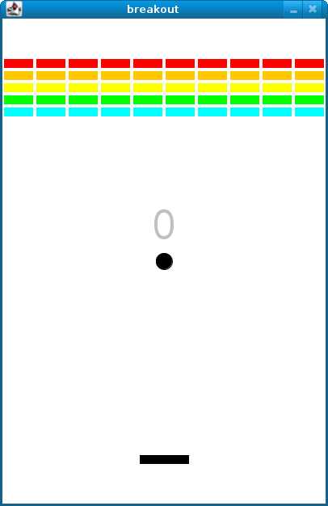

# CS50 AP Workshop 2017

## CS50 Tools

### Introductions
- Brian Yu and Chad Sharp introduce themselves.
  - Brian is a CS50 teaching fellow and both Chad and Brian work on CS50 software development.

### CS50 IDE
- Integrated development environment (IDE) that lives in the cloud.
  - A place online where students can access, run, and edit their code.
  - Students can install additional packages and software into the IDE.
  - Can run code code in any language, not just C and Python.
  - Not tied to hardware, so students can access the IDE from any computer.

#### Features
- collaboration mode
  - Accessed by clicking the "Share" button in the menu bars.
  - You can invite someone to read/write access to your workspace.
  - Students can add other students for collaborative activities.
    - The code is highlighted based on who wrote it.
  - Students can also share their workspace with you, the teacher.
- file revision history
  - Go to the "File" menu and click on "View File Revision History."
  - A bar will appear above the file to show all the different saves on a timeline.
    - You can see all the historical versions of the code.
      - Nifty if you accidentally delete a file.
  - Useful for plagiarism detection as well.
- presentation mode
  - Go to the "View" menu and click "Presentation Mode."
    - Everything gets bigger and easier to see.

#### CS50 IDE Tools
##### `help50`
- Command-line tool for parsing error messages and providing suggestions.
  - Helps students understand cryptic error messages that are outputted.
- For example, examine the following code for a program called test.c:
  ```c
  #include <stdio.h>

  int main(void)
  {     
      int x = get_int();     
      printf("%i\n", x);
  }
  ```
  - The issue here is that `get_int()` requires `#include <cs50.h>`, so this program won't compile.
  - When a student tries to compile this program running `make test`, they would see the following message:
    ```
    clang -fsanitize=integer -fsanitize=undefined -ggdb3 -O0 -std=c11 -
    Wall -Werror -Wextra -Wno-sign-compare -Wshadow    test.c  -lcrypt
    -lcs50 -lm -o test
    test.c:5:13: error: implicit declaration of function 'get_int' is
    invalid in C99 [-Werror,-Wimplicit-function-declaration]    
        int x = get_int();            
                ^
    1 error generated.
    make: *** [test] Error 1
    ```
      - This message can be intimidating for students as it's a lot of cryptic text.
      - Typing `help50 make test` will try to parse the error and give a more human-friendly explanation like this:
        ```
          You seem to have an error in test.c on line 5. By "implicit
          declaration of function 'get_int'", clang means that it doesn't
          recognize get_int. Did you forget to #include <cs50.h> (in
          which get_int is declared) atop your file?
        ```
        - `help50` will also ask rhetorical questions to guide students in the right direction.
- Built into the CS50 IDE.
  - Can also paste error messages at [help.cs50.net](help.cs50.net).
- Currently handles 150+ error messages.
- Completely open source.
- CS50 tracks every time `help50` is ran and doesn't understand the error.

##### `check50`
- Once a student has compiled their program, it is useful to see if it is correct or not.
- Runs student code against tests created by CS50.


- Tests that students pass are denoted with `:)` and green text.
- Likewise, tests that students fail are denoted with `:(` and red text.
- Certain common errors have additional text similar to `help50` to push students in the right direction.
- Open source: anyone can contribute by adding new checks, or adding new problems.
  - Located at [github.com/cs50/check50](https://github.com/cs50/check50).
- Includes hints for some incorrect responses: tries to catch common mistakes and help students correct them.

##### `debug50`
- CS50 IDE's built in visual debugger.
- Allows students to set breakpoints.
  - This will pause program at any line of code.
    - Can see the value of variables at that point in time.
    - Can step through the program one step at a time.
- Can view and modify values of all variables during execution

##### `style50`
- There are many good ways to style code, but infinitely many more ways to do it poorly.
- CS50 has its own code [style guide](https://manual.cs50.net/style) for students to conform to.
- Checks code for adherence to style guide.
  - Compares the student's program to a properly styled version of the same code.
    - Count the differences and determine a score.
- Version 1 built into CS50 IDE now, new version in the works.
  - The new version will allow students to look at their code and the correctly styled code on the IDE to compare.
  - The new version will also automatically calculate a score and enter it into the gradebook.
- When one works for a company, typically they have a style guide that they ask you to conform to.

##### `submit50`
- Method in which students submit their code.
- Pushes submission to github.com/submit50/username.
  - Effectively a wrapper around git.
- Stores all versions of a submitted file.
  - All stored at github.com/submit50/username.
- Easy to comment on file, students get email notifications of new comments.
- Can view submissions on GitHub or on [CS50.me](https://cs50.me).
  - CS50.me effectively displays GitHub's interface in a more user-friendly way.
- Automatically runs correctness testing, added to gradebook.
  - Automatic grading for style will be added soon!

##### Droplet
- In the first week of class, CS50 introduces coding using the block-based language Scratch.
  - No need to worry about syntax.
  - Then, CS50 moves into C, which can be a syntactically daunting transition.
- Droplet coverts code into Scratch-like blocks.
  - Can drag and drop code blocks just like C.
- You can start Droplet by clicking on the "Text" button on the lower right corner of the IDE.
  - Works on version 101+ of the CS50 IDE.
    - Run `update50` if not up to the current version.
- This helps students better make the transition from Scratch to C.
- Droplet won't translate code into blocks if there are syntax errors.

### CS50.me
- CS50's centralized submission and grading platform.
- Uses students' GitHub credentials for login.
- Integrated with `submit50` and `check50`


- Effectively, `submit50` pushes student code to GitHub, where CS50.me can access it and run check for grades.
  - Teachers can comment on student code directly on GitHub.
#### Student View
- On CS50.me students can view:
  - all submitted programs
  - comments on their code on GitHub
    - Students are notified via email when a teacher has added a comment to their code.

    

    - Teachers can save comments for repeated use.

      

  - any scores entered into CS50.me gradebook

#### Teacher View
- students grouped into "sections"
- invitation link to distribute to students
  - When students click on the invitation link, they will join your section.
- can view and comment on student submissions via GitHub
  - You can grade by individual problems or students.

#### Gradebook
- automatically tests correctness of code and inputs scores
- includes fields for design and style
  - This is where the teacher focus for grading will largely be.
- correctness scores can be overridden
- shows all problems that a student has submitted

#### CS50.me Updates
- Version 1

  

- Version 2
  - Allows for custom assignments in addition to CS50 problems.

  

### Breakout
- Before the existence of the CS50 IDE, students used to do a problem set called Breakout.
  - Students would recreate the classic game Breakout, a brick-breaking game where a ball bounces from the top with a paddle at the bottom.
    
  - Problem was that the graphical capabilities of the online IDE were more limited than on a local computer.
  - Chad is working on resurrecting this problem set to work on the CS50 IDE.
  - This problem set is given when students are focused on C.
  - Breakout utilizes the Stanford Portable Library (SPL), which makes graphical programming easier for students.
    - Creates objects like paddles and balls for students.
    - The goal is to rewrite SPL in a way that it will output web browser-capable JavaScript, rather than an executable.
      - Transpiling a C into JavaScript rather than compiling it into machine code.
        - Transpiling is like translating.
- The goal is to bring this problem back this fall.

### Reference50
- Sean Walker takes the stage to talk about Reference50.
- Reference50 is a one-stop-shop for figuring out what different C functions do.
  - A comprehensive encyclopedia of C Standard library functions.
- More dynamic and accessible versions of `man` pages.
  - `man` pages can be a bit too arcane for new C students to understand.
- Reference50 uses:
  - studying
  - lookup by function name, library
  - "Less Comfortable" mode: simplified language
  - "More Comfortable" mode: more like `man` pages, emphasis on technical reading
  - "Less Comfortable" and "More Comfortable" modes can be toggled between.
- Improvements
  - "Less Comfortable" could use expansion
    - more, better examples
    - integrated practice problems
    - information can be trimmed down
  - To improve Reference50, the CS50 staff have been pulling inspiration from the old CS50 Study site.
    - CS50 Study has slides of information and practice problems for various topics and C functions.
- Reference50 future:
  - Comprehensive for all brands of CS50
    - @Harvard/@Yale
    - X
    - AP
  - function/library reference tool
  - programming exercises/practice problems
  - themed around CS50 topics
  - Reference50 mockup entry for `strlen`:

    

    - explanations are a bit more human-readable
    - examples are more complex
    - problems
      - Students can look at a staff solution to enhance practice.
  - further plans
    - IDE integration
    - separate practice problem website
      - sorted by category and tags

### CS50 QuizBank
- Davey Proctor takes over to talk about CS50 QuizBank.
- CS50 QuizBank lives at (quizbank.cs50.net)[https://quizbank.cs50.net/].
- The material here can be used for practice questions or quiz questions.
- Bank of every question ever asked on a CS50 quiz.
- Can search through questions based on:
  - year
  - topic
  - public availability
- Teachers can create quizzes from the questions.
  - Add questions from the database to a quiz to be downloaded as a word document or pdf.

### ap.cs50.net
- Haley James transitions to discussing [ap.cs50.net](https://ap.cs50.net).
- The homepage has general information about CS50 AP.
- Teachers also have their own site that cab be accessed by signing in.
- Users can search though CS50 AP curriculum and resources.
  - Teacher can customize their own version of the site.
    - Determining what students should see when visiting the site.
- The resources available include:
  - videos
  - written resources
  - slides
  - external resources
    - Useful resources not created by CS50.
  - learning objectives
  - CSTA mapping
  - programming problems
  - written problems
  - teaching tips
  - demonstration ideas
  - thought questions
  - reference sheets
    - One page summaries with information on various topics.
  - private for teachers
  - sample solutions
  - enduring understandings
