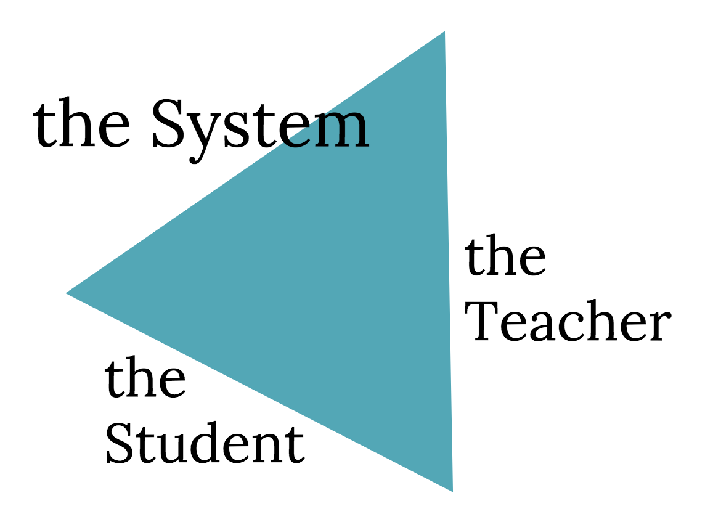

# CS50 AP Workshop 2017

## Diversity Recruiting

### Introductions
- Jolina Clement and Erin Harris introduce themselves.
- Jolina Clement
  - Director of Educational Technology at the Archer School for Girls in Los Angeles, CA.
  - Taught for about 14 years in different environments.
    - in Japan
    - giving afterschool intervention
    - performing arts
    - special needs
    - elementary public school
  - Grew up in the Bay Area.
  - Jolina's mom taught at Cupertino High School
  - A music undergrad.
- Erin Harris
  - Teaches middle school and upper school Computer Science at the Archer School for Girls in Los Angeles, CA.
  - After graduating from UCLA, started teaching at Archer.
  - Undergrad in Material Science and Engineering, but after graduating found the beauty in Computer Science.

### Why do you want students in Computer Science?
- Reasons to get students interested in CS:
  - There is a huge demand for CS skills.
  - Solving big problems requires people of all different backgrounds.
  - Helping students to think differently.

### Technology in Education
- Seymour Papert is the godfather of technology in education.
  - Logo programming, created Lego Mindstorms, ...
  - When you use technology you can only satisfy one side of the following triangle.

    
    - serving the system
      - data analysis
    - serving the teacher
      - smartboards
      - learning management systems
    - serving the students
      - Give students the skills, training, and agency to be able to make something and participate in this world actively.
        - What teaching CS is about.

### Student Messaging
- Students get a lot of messaging on programming these days.
  - toys that help kids code
  - summer camps
  - listicles
  - articles
  - tv news
  - people talking about how cool it is to be a programmer
  - the prevalence of jobs
- To filter through all of this information, we need to focus on "Why" again.
- “The computer is incredibly fast, accurate, and stupid. Man is unbelievably slow, inaccurate, and brilliant. The marriage of the two is a challenge and opportunity beyond imagination.”
  - The combination of tech and humanity is where the sweet spot is.
  - Technology is not neutral.
    - It elevates the person.
    - It can be an enabler or an accelerator.
  - This marriage is where the true motivation lies.

### History of Tools and Development
- As humans, we are able to develop tools (technology) that help us control our environment and solve problems.
- What we choose to do with technology determines what will happen next.
- “If you can’t open or alter it, you don’t own it.” - Bob McIntosh, MidPacific School, Honolulu, HI
  - Why learn CS?
    - "... to function in a world where if my thermostat breaks, I can open it, kinda look at it, and not be subjected to whoever decides comes in and charges me $500 to (fix it)."
    - Becoming empowered by experience to be an active participant in the world.

#### History of Programming
- Stories about women in tech such as Ada Lovelace and Grace Hopper are motivating to some people but not all.
  - Jolina states that they are great achievements but is not sure how they apply to her.
  
