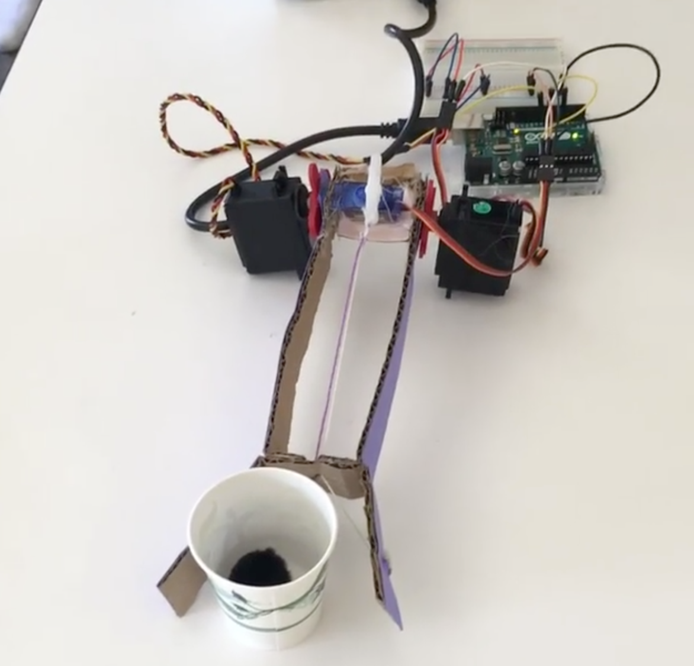
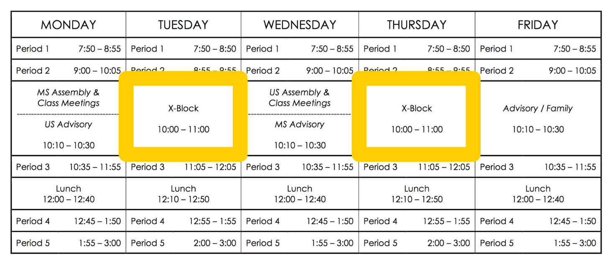
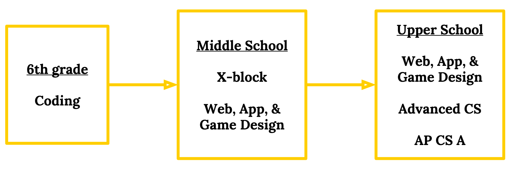

# CS50 AP Workshop 2017

## Diversity Recruiting

### Introductions
- Jolina Clement and Erin Harris introduce themselves.
- Jolina Clement
  - Director of Educational Technology at the Archer School for Girls in Los Angeles, CA.
  - Taught for about 14 years in different environments.
    - in Japan
    - giving afterschool intervention
    - performing arts
    - special needs
    - elementary public school
  - Grew up in the Bay Area.
  - Jolina's mom taught at Cupertino High School
  - A music undergrad.
- Erin Harris
  - Teaches middle school and upper school Computer Science at the Archer School for Girls in Los Angeles, CA.
  - After graduating from UCLA, started teaching at Archer.
  - Undergrad in Material Science and Engineering, but after graduating found the beauty in Computer Science.

### Why Do You Want Students in Computer Science?
- Reasons to get students interested in CS:
  - There is a huge demand for CS skills.
  - Solving big problems requires people of all different backgrounds.
  - Helping students to think differently.

### Technology in Education
- Seymour Papert is the godfather of technology in education.
  - Logo programming, created Lego Mindstorms, ...
  - When you use technology you can only satisfy one side of the following triangle.

    
    - serving the system
      - data analysis
    - serving the teacher
      - smartboards
      - learning management systems
    - serving the students
      - Give students the skills, training, and agency to be able to make something and participate in this world actively.
        - What teaching CS is about.

### Student Messaging
- Students get a lot of messaging on programming these days.
  - toys that help kids code
  - summer camps
  - listicles
  - articles
  - tv news
  - people talking about how cool it is to be a programmer
  - the prevalence of jobs
- To filter through all of this information, we need to focus on "Why" again.
- “The computer is incredibly fast, accurate, and stupid. Man is unbelievably slow, inaccurate, and brilliant. The marriage of the two is a challenge and opportunity beyond imagination.”
  - The combination of tech and humanity is where the sweet spot is.
  - Technology is not neutral.
    - It elevates the person.
    - It can be an enabler or an accelerator.
  - This marriage is where the true motivation lies.

### History of Tools and Development
- As humans, we are able to develop tools (technology) that help us control our environment and solve problems.
- What we choose to do with technology determines what will happen next.
- “If you can’t open or alter it, you don’t own it.” - Bob McIntosh, MidPacific School, Honolulu, HI
  - Why learn CS?
    - "... to function in a world where if my thermostat breaks, I can open it, kinda look at it, and not be subjected to whoever decides comes in and charges me $500 to (fix it)."
    - Becoming empowered by experience to be an active participant in the world.

#### History of Programming
- Stories about women in tech such as Ada Lovelace and Grace Hopper are motivating to some people but not all.
  - Jolina states that they are great achievements but is not sure how they apply to her.
  - What's more galvanizing to Jolina is learning about subjugation of women in CS.

### Fighting Subjugation
- "Programmers master a system they know they can change." - Deborah Meier
  - Giving people agency prepares people to become active participants in our democracy.
  - Subjugation conditions people to be controlled.
    - Who do controlled students grow up to be? How do they vote?
- "The most important thing that we can infuse in the next generation is creativity and confidence" - Ayah Bdeir, littleBits founder and CEO.
  - Helping students explore and create things.
  - Developing creating thinking
  - These traits come from Computer Science principals.

### Looping Back to Why
- including people
  - The people who stand to gain the most from Computer Science are the ones:
    - being marginalized
    - being controlled
    - who have something to say
      - Which is everyone.

### CS50 at Archer
- Erin Harris transistions to talking about how CS50 is ran at Archer.
- The class make up of 8 students.
  - 5 seniors, 1 junior, 1 sophomore, and 1 freshman.
  - Only 2 students have no previous programming experience.
- The course is a science elective credit
  - Archer doesn't offer AP Sciences.
    - No students took the AP exam.
    - Allowed students to take the AP exam on their own if desired.
      - AP was not the main focus of the course.

#### Average Day at Archer
- Four to three 1-hour classes a week.
- Utilized a flip teaching model.
  - Students watch lecture at home.
  - Work on homework to introduce topics.
  - Lab time given to students in-class.
    - Every student has a laptop.
- Spend ~30 min of class introducing the new topic.
- Exit tickets for formative assessment.
- Work on problem sets in class.
- Office hours held 2x a week.
- Allowed students to resubmit problem sets.
  - At any point in the year, students could fix something and get 100%.
    - Helps build a culture of error.

#### Deviation from CS50 AP Curriculum
- In January, students were beginning to check out, so Erin elected to ask students what topics they would be interested in.
- After Chapter 4, we covered other topics including:
  - Arduino
  - Processing
  - HTML/CSS
  - Javascript
- One project had student create a robotic arm given art supplies, servos, and an Arduino.
  - Connected the project to the growing prosthetic industry.
    - Highlights that computer science can be related to other fields.

#### Things That Worked at Archer
- class/group problem solving
  - Students loved working on problems together.
- real-world problems
  - CS50 curriculum does a great job of focusing on real-world applications.
  - Girls think "Why are we learning this?" a lot.
    - Real-world problems get them engaged.
- allowing students to resubmit any assignment
- asking for feedback
  - Erin asks for feedback twice during the year.
  - For example, Erin asked her students about how they felt working on problems alone and they expressed interest in collaboration.

#### Things That Didn't Work
- asynchronous learning
  - This is especially true for girls.
    - They need to feel connected to their environment.
- not front loading pair programming
  - Students didn't know how to properly work on code together.
- CS50 AP culture hard to maintain
  - Events such as taking attendance and fire drills interrupt flow.

### CS at Archer

#### School Schedule

- 7-day rotating schedule
  - Students have 7 different classes that rotate to fill 5 periods each day.
  - X-Block are non-academic, creative opportunities to pursue something.

#### CS Sequence

- Coding in 6th grade used to be a language course.
- In middle school, the students can look into Web, App, & Game Design or utilize the X-block to learn snippets of coding.
- Advanced CS = CS50
- AP CS A not offered on campus, but the students can take it thought One Schoolhouse, an online learning community for single sex education.
  - This is because the school is small and AP is no longer a focus at Archer.
    - ~500 students

#### Other CS Electives
- Engineering & Design
  - Basic principles of engineering, design, and computer programming through a series of individual challenges and group projects.
- Honors Research
  - Implement an original scientific study with a focus on molecular biology, chemistry, biochemistry, or engineering.
- Product Design
  - InvenTEAM - Lemelson-MIT Program
    - 3 or 4 year program where students develop a product, design it, prototype it, and pitch it.

#### Hackathon
- CS50 Hackathon is a bit grandiose for Archer.
- Collaborated with teachers from other schools.
  - There are a lot of schools in LA with motivated people.
  - Partnered with another school and opened the event up to all schools.
- 1 day event that culminates in a judged walkthrough.
  - 8 hours long
- Students in 9th-12th grade with any programming experience.
- Over 40 students came to the event.
- The focus of the hackathon was teen health.
  - Gave the students time to brainstorm and form ideas.
- Obtained sponsorships from SnapChat and other organizations.
- Swag and prizes were given out.
  - Prizes were given out to students based on 3 areas.
    - technical proficiency
    - marketability
    - ambition
- For more information about this hackathon, check [xrds.org/hackathon](xrds.org/hackathon).
- If your in the LA area, you are welcome to come next year.

#### Successes
- projects that are low-floor, high ceiling
  - Important to make projects accessible but profound.
- introduce CS in middle school
  - Obtain student interest before they choose another track.
- trick teachers into integrating CS into other courses
  - A lot of teachers were interested in what was being taught through CS at Archer.
  - Archer gave teachers in-house professional development on CS.
  - Erin created a website where teachers could share what they are teaching.
- science APs are not offered
  - This was a success from a teacher’s perspective.

#### Challenges  
- science APs are not offered
  - Students wanted to take AP tests and couldn't.
- competing with arts electives
  - It's hard to compete for time with all of students' interests.
  - Integration into other subjects is one solution to this.
- scaffolding appropriately
  - Don’t get too zealous!
    - Students may not be as excited about topics your interested in.
- beyond high school
  - Important to discuss impact of women in CS.

### Strategies for Inclusion in CS
#### What Works in the Classroom
##### Your Actions
- "Supportive Words & Actions" from Darryl Yong at Harvey Mudd
  - Value and allow students to demonstrate a broader range of competencies.
    - Allow students to add creativity.
    - Not just assessing knowledge via multiple-choice tests.
  - Affirm student’s accomplishments. Praise tenacity and effort.
    - Acknowledging your students helps students, particularly women and minorities, feel included.
  - Be more aware of your interactions.
  - Be more transparent about our instructional choices so students don’t question if you’re singling them out.
  - Apologize when you mess up.
    - Create a culture of error.
  - Ask for feedback!

##### Curriculum
- low floor, high ceiling
  - Have extensions for projects.
- real-world purpose
- agency in their learning
- class/group problem solving
- share projects with community
  - Let students choose which projects to present.
    - Students form pride for their creations.

#### What Works Outside the Classroom
- providing low risk opportunities for anyone with any programming experience
  - hackathons
- curated list of summer STEM opportunities
  - preferably free
  - Girls Who Code
- unplugged CS Activities at community events
  - pseudocoding events for family members
  - This helps destigmatize this CS with different populations.
- showcasing student artifacts & experiences
  - Student creations are celebrated in the halls at Archer.

#### Who Knows if this Works Yet?
- teach colleagues some coding
  - This creates normalcy and a sense of culture.
- field trips
  - art exhibits that involve tech
  - tech companies
