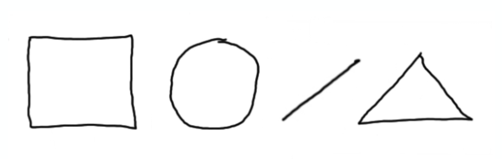

# CS50 AP Workshop 2017

## This is CS50

### Introductions
- Erin Carvalho and Doug Lloyd briefly introduce themselves and review the schedule for the day before introducing David Malan.
- David introduces himself and talks about the purpose of the workshop as a method for creating a teaching community.
- He then talks about his background in teaching, emphasizing his experience teaching math with only a text book.
  - This is contrast with CS50 and its OpenCourseware and tools.

### Resources
- David lists some of the various resources available to CS50 teachers, including:
  - Lectures
    - Notes
    - Slides
    - Subtitles
    - Transcripts
    - Videos
  - Problem sets
    - Distribution code
    - Problem specs
    - Solutions
  - Sections
    - Lesson plans
    - Slides
    - Source code
  - Shorts
    - Subtitles
    - Transcripts
  - Walkthroughs

- In addition, David runs through the following tools that are at a CS50 teacher's disposal:
  - CS50 IDE
    - CS50 IDE is could-based, so no need to download software. An offline version exists for students with limited internet connectivity.
  - CS50 Library
    - Software that simplifies C tasks.
  - CS50.me
    - Student access to submitted problems and teacher feedback.
  - CS50 Programmer's Manual
  - CS50 Quiz Bank
  - `check50`
    - Correctness testing tool.
  - `debug50`
    - GUI-based debugger.
  - `help50`
    - Tool to approximate advice for problems that a teaching fellow would give.
  - `render50`
    - Tool for rendering code as pdf.
  - `submit50`
    - Tool for student submission of code.
  - `style50`
    - Tool for evaluating code's style.
  - GitHub
  - Travis CI

- The following serve as social support structures:
  - Facebook
  - Gitter
  - Reddit
  - Slack
  - Stack Exchange
  - Twitter

### CS50 Community

- David showcases the CS50 community by showing a global map and breakdown of all the implementations of CS50.
  - CS50
    - 700 students at Harvard College
    - 150 students at Yale College
    - 300 students at Harvard Extension
  - CS50x
    - 1M+ registrants on edX.org
      - Kansas City, Miami, Rhode Island, St. Louis, ...
      - Bolivia, Burma, Chile, Netherlands, Nicaragua, UK, Ukraine, ...
  - CS50 AP
    - 150 high schools
    - 5,000 students
  - CS50 for MBAs
    - 100 students at Harvard Business School
- David showcases a full Sanders Theater, where CS50 lectures are filmed.
  - One of the purposes of recording at Sanders is to allow students to have access to such a space representative of higher learning.
- Running though images, David looks at previous cohorts of CS50 AP and CS50x teachers from around the United States and across the world.
- "what ultimately matters in this course is not so much where you end up relative to your classmates but where you, in *week 11*, end up relative to yourself in *week 0*"
  - There is a subjective, human element when grading design of code.
  - Keep in mind students' previous CS comfortably.
    - At the beginning of the year, students self-select if they are More Comfortable, Less Comfortable, or somewhere in the middle.
      - Determine sections based on this choice
      - More Comfortable and Less Comfortable versions of some problem sets
      - 61% Less Comfortable
      - 29% In Between  
      - 10% More Comfortable
    - Supermajority of students don't end up being CS majors, but rather create a strong CS foundation to bring to other fields.

### Curriculum
#### Concepts
- Scratch
  - Graphical programming language from MIT.
  - Ability to explore programming ideas without the distraction of syntax.
- C
  - Arrays
  - Algorithms
    - Searching, sorting, ...
  - Memory
    - Pointers
    - Memory management
  - Data structures
    - Linked lists
    - Hash tables
    - Tries
- HTTP
  - The internet
- Machine learning
  - Sentiment analysis
- Python
- SQL
- JavaScript  
  - Web-based projects

#### Problem Sets
- Scratch
  - The assignment is simply to make something of interest of you.
- Credit, Greedy, Hello, Mario, Water
- Caesar, Crack, Vigenere
  - Cryptography
- Fifteen
  - Introduction to working with distribution code.
    - Helpful for having students practice reading other people's code, a common practice in industry.
- Recover, Resize, Whodunit
  - Forensics
    - David once worked with forensics, recovering info from hard drives.
    - Students have to recover "deleted" images from a drive.
  - Images
    - Like a cereal box toy from yesteryear, students have to figure out a reddened figure using code in Whodunit.
- Speller
  - Using various data structures of their choosing, students implement the fastest, most efficient spell checker.
  - CS50 measures the MB of RAM and seconds it takes a student implementation to check various words and reports it to a leaderboard.
- Sentiments
  - Analyze tweets to decide if they were positive, negative, or neutral.
- C$50 Finance
  - Get nearly real-time stock quotes though yahoo finance and buy and sell stocks.
  - Can watch your portfolio change in value.
  - Some students realized that they could get more up-to-date info on stocks elsewhere and make a lot of (fake) money.
- Mashup
  - JavaScript and SQL are used along with Google's Maps and News APIs to create a mashup site.

- CS50 is amalgam of what most universities might call CS 1 and CS 2.

### CS50 Culture
- CS50 Puzzle Day
  - Early in the semester, puzzles created by friends at Facebook and CS50 staff are worked on by students and friends for a few hours.
  - Puzzles are not programming-based, as to emphasize that CS is not about programming, but rather problem solving more generally.
- CS50 Lunches
  - Held every Friday.
  - Makes a large class feel smaller.
- CS50 Coding Contest
  - Held mid-semester after students feel comfortable with C with a leaderboard.
- CS50 Hackathon
  - Bringing students together to work on homework problems or projects.
  - On campus at Harvard, it occurs at the end of the semester as a 12-hour event to work on final projects.
    - Starts at 7pm
    - Mexican Food at 9pm
    - Pizza from Dominos at 1am
    - Trip to IHOP at 5am
  - At High schools
    - Mid-Semester event to bring students together and get them reengaged.
- CS50 Fair
  - Students showcase final projects.
  - If in the Massachusetts area, or Connecticut for Yale, feel free to stop by.
    - 250 high school students came to the Harvard CS50 fair last year.
    - 150 went to Yale.
    - Opportunity for undergraduates to share information and to galvanize high school students.

### CS50 Structure
#### At Harvard College
- 2-hour lectures
  - Live-streamed and made available online.
- 90-minute
  - Lead by teaching fellows for about 10 to 20 students.
  - Additional examples and other materials.
- Office hours
  - 100+ students coming to Harvard's Widener library to receive help on problem sets.
- The course is 12 weeks long.
  - 8 problem sets
  - 1 test
  - 1 quiz
  - 1 final project
    - Culmination of student progress.
    - Students build something of interest to themselves.

#### CS50x
- CS50x is the MOOC (Massive Open Online Course) on edX.
- Uses same materials as CS50 on campus at Harvard.
  - Materials from the previous fall semester are made available January 1, and left up for the entire year.
- The course is 52 weeks long.
  - 8 problem sets
  - 1 final project
- There is less of the teaching support structure
  - Harvard has between 80-100 undergraduates who work as teaching fellows for CS50 at the College.

#### CS50 AP
- Again, curricularly and technologically identical to CS50.
- Teachers may use 36 weeks or so for the course.
  - Thus, the curriculum has been adapted for the pace of secondary school.
    - The structure is more of a schedule of topics with the ability to add or remove topics as need be.
- College Board
  - 2 performance tasks
  - 1 exam

### In Conclusion
- If CS50 were to be simplified into a few concepts:
  - Accessibility
    - Not easy or light, but accessible to students with less background.
    - Evaluating students relative to where they began.
  - Community
    - Not traditional element of culture, through events and collaboration.
    - To create a unique educational experience.
    - "I took CS50" shirts
      - Unique badge of pride or relief that represents all that students get out of the course.
  - Rigor

### Week 0 Activities
- David transitions to demonstration of algorithmic thinking.
- David, Erin, and Doug pass out paper and pens.
- David searches for a volunteer and Patti obliges.
- Patti looks at an image that only she can see. Her goal is to express only verbally the picture. The audience is to draw an image based on only her directions.
- Patti gives directions to draw the following image. 
  
- Then, David showcases some drawings from the audience to show how varied they look.
- David points out that Patti utilized low-level language and highlights the importance of abstraction to convey ideas.
- He mentions that the purpose of this activity is to clean up students' computational thinking to help them think more algorithmically.
- David seeks to flip this activity around and looks for another volunteer. Lizzy agrees.
- Lizzy has to draw on a blackboard given directions from the audience. Only the audience can see the image.
- Lizzy attempts to draw the following image based on crowd input.  
  
