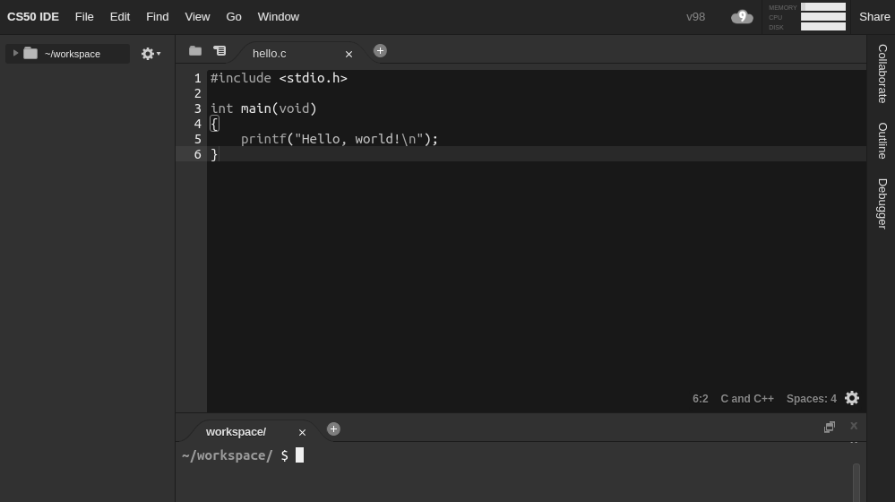

# The CS50 IDE

## What is it?

The CS50 IDE (https://cs50.io) is a cloud-based Integrated Development Environment and it's amazing!

It features an Ubuntu environment with a browser-based editor, that supports C (as well as python, html/css, JavaScript, and much more!) syntax highlighting and word completing, a GUI-based GDB debugger, and customizable options such as layouts, themes, and keyboard shortcuts. Users can continue working on problems even if they use different computers as it is cloud-based. As it's cloud-based, no downloaded software or specific hardware specifications are required. You and your students will be using the CS50 IDE throughout the school year for creation, debugging, collaboration, and submission of programs.

## CS50 IDE Setup

To have your students set up the CS50 IDE you’ll want them to do the following:

### 1. [Create an edX account](https://courses.edx.org/register)

edX is a MOOC (Massive Open Online Course) provider created by MIT and Harvard University. An edX account is free to sign up for and students can use their Facebook, Google, or Microsoft credentials to register for an account or create one from scratch. Students will use the login credentials for edX to access their personal CS50 IDE.

### 2. [Set up the CS50 IDE and tour its features](https://manual.cs50.net/cs50-ide/online.html)

Logging into and updating the CS50 IDE is all students need to do in order to set up the IDE.  At this time, it would be beneficial to have students tour some features of the IDE and become comfortable with updating, working with files, opening and using terminals, customizing the workspace, etc.

For future access to the CS50 IDE, students simply login using their edX credentials at https://cs50.io.

> Note: You will likely want to follow the same steps as your students to get a good feel for the usage of the CS50 IDE. Both you and your students will likely be interacting with the IDE on a daily basis during the school year.

## Commands

The CS50 IDE supports the following useful commands that can be written in the terminal:

| Command                              | Description                                                         | Example                             |
|--------------------------------------|---------------------------------------------------------------------|-------------------------------------|
| `./[program_name]`                   | _Runs C programs._                                                  | `./hello`                           |
| `check50 [problem_name] [file_name]` | _Runs code through test cases to check for *correctness*._          |`check50 cs50/2017/ap/hello hello.c` |
| `debug50 file_name`                  | _Runs the GDB debugger._                                            |`debug50 file_name`                  |
| `help50 [command_line_arguments]`    | _Provides help for error messages._                                 |`help50 make hello`                  |
| `make [program_name]`                | _Compiles C programs._                                              |`make hello`                         |
| `python [file_name]`                 | _Runs python programs._                                             |`python hello.py`                    |
| `style50 [file_name]`                | _Checks if student code conforms to CS50's style guide._            |`style50 hello.c`                    |
| `submit50 [TBD]`                     | _Allows students to sumbit code to [**cs50.me**](https://cs50.me)._ |`TBD`                                |
| `update50`                           | _Updates the IDE to the current version._                           |`update50`                           |

## More Information

If you want more information on how to use the online CS50 IDE, please visit [our manual page](https://manual.cs50.net/cs50-ide/online.html).

For students who may not have reliable access to internet at home, the CS50 IDE can also be downloaded as an [offline version](https://manual.cs50.net/cs50-ide/offline.html) using Docker! Students can then sync changes in their IDE with the online version when they get on school wifi.
